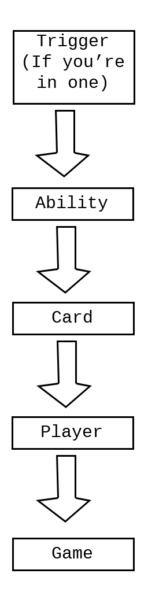

Topics for people who really want to get into the weeds.

---

## "This card's..." is a Lie

The "This card's..." block is common way to quickly use properties of the card you're editing, but what it actual does is a bit more complex. "This card's..." searches through a hierarchy of different objects, looking for the property you've picked.

### Object Types

- Trigger - If you're inside of a triggered ability or a When Trigger Happens... block, you'll have some extra properties e.g. Triggering Object. You can think of these properties as existing on their own object in the hierarchy - the instance of the trigger.
- Ability - The ability you're currently editing. E.g. you might want to access the Mana Cost property of an Active.
- Card - The card you're editing, self explanatory.
- Player - The card's controller.
- Game - Stores global values, e.g. the Turn Number property.

### When this causes confusion

- Since "This card's..." checks all of the above objects, and "Get Property of something..." checks only one object, the list of properties available when using these blocks are different.
  - The Target property is actually a property of abilities, meaning it won't be accessible from "Get Property of something..." looking at a card.
- With triggers, the trigger-specific properties are only accessible from "This card's..." blocks.

  - Example: The global Card Changes Zones trigger includes four trigger properties

    - Moving Object - The card that moved
    - From Zone - The zone the card moved from.
    - To Zone - The zone the card moved to.
    - Triggered On - same as Moving Object (redundant)

    A common misconception is: to get the To or From zone property of the moving object, it should be retrieved using a "Get Property of something..." block on the Moving Object. Instead, From Zone and To Zone are properties of the trigger, so "This card's..." is the only way to retrieve the property.

## Character means Hero

Information about a player's hero is accessible from that player's Character property. Characters have the same properties as cards, but most of them don't do anything.

## Direct Card Synergies are Standardized to Filter by Name

If a card directly synergizes with an explicitly named card, such as ["Friendly Flames have +1 ATK"](https://www.collective.gg/try-out?imgurl=https://files.collective.gg/p/cards/33324590-b529-11e9-81a9-b3714a7bf7df-m.png), it should filter cards by their name, not their blueprint.

This means a card like [The Nameless](https://www.collective.gg/try-out?imgurl=https://files.collective.gg/p/cards/e8628a00-bbca-11e8-a03e-8fe629cc6789-s.png) will "steal" the passive +1 ATK from a friendly Flame token by "stealing" its name.

### What is a Blueprint in the Card Creator?

A card's Blueprint in the Card Creator is essentially a set of instructions on "how to make a new copy of a card." It is most analogous to a card's DNA.

If a card says "make a copy of whatever unit attacked most recently," like in [this tutorial video](https://www.collective.gg/card-creator-videos#three), it needs to the Blueprint of the card that most recently attacked so it can make another copy of the same card. Obviously it should not look for a card with the same name as whatever most recently attacked, and also, if a Flame whose name had been taken away was the most recent attacker, it should make another Flame.

"Blueprint" a poor choice of terminology we'd like to change later, because it's used again for a completely separate and very important thing in the game's economy.

### Weird... Why Filter by Name?

Three reasons:

1. **There is an upkeep cost inherent in making sure all token cards created by multiple kinds of cards refer to the same blueprint.** Also, some players have requested the ability to remake the art for certain token cards (Flames being a [real example](https://www.reddit.com/r/collectivecg/comments/fu49rs/card_flame_tongue/)).
1. **We plan on eventually allowing players to change everything about a card, including its art, which will lead to players being required to take notes or memorize a card's blueprints.**
   - As it stands right now, you can't change a card's art; this means that there's no chance of anyone confusing one card for another, as the first thing you notice about it (its art) is permanently connected to its "real identity" (its blueprint). Once players can change everything about a card, including its art, we expect to see effects like "turn all units in play into [Fluffy Boi](https://www.collective.gg/try-out?imgurl=https://files.collective.gg/p/cards/f68aed70-6f8a-11e8-a7a3-e1547b2ef117-s.png)," and change everything about its targets, including their art, to be like Fluffy Boi. Again using the Seal of Flame example, if some of your units were Flames and others weren't (but then all of them turned into Fluffy Bois), if we filtered by blueprints, you and your opponent would have to remember which card was "really" a Flame before being transformed. After a player learns that cards filter by name, they can hover over a card and know everything they need to know about it, no matter what weird effects have been added to the game.
   - Filtering by blueprint doesn't seem very important when you're just looking at Seal of Fire, but it could be extremely relevant with an effect like [Who?](https://files.collective.gg/p/cards/4ceda6e0-84cf-11e8-9fcf-35800ae656e2-s.png) (which originally banished a card and "all other copies of that card," filtering by blueprint). Without setting a precedent that a card's name is its identifier, who's to say what makes a card "the same card" as another one? If my card reads "turn all units in play into Fluffy Boi," did they "really" turn into Fluffy Bois? You can see how this can cause confusion in a game where players create their own cards with crazy effects: the only way to actually refer to something via card text is to use its name, so once you get over that, it becomes very clear how things will work. This also creates shared design space for some interesting counterplay down the line; perhaps a strategy revolving around [Vox](https://www.collective.gg/try-out?imgurl=https://files.collective.gg/p/cards/e805cad0-ee9d-11e8-9aa0-6505e14c53a5-s.png) can be countered by stealing Vox's name, for example.
1. **We want to set a precedent that some things are features that only advanced card creators need to understand.**
   - "Blueprint" is an annoyingly complex concept, but it's necessary for making many kinds of effects. Until we made this decision, new players had to understand the concept of a blueprint to understand what to expect from some card's effects. This is OK, but points in a bad direction. We can't require players of Collective to understand obscure details of how the Card Creator works just to know what cards will do. Even if everyone in the current community agrees on something, it can still be confusing to new players. This is a lofty goal, but ideally we would like Collective to be equal or better than other card games in every way possible. This means never compromising the players' experience to benefit that of the creators.
