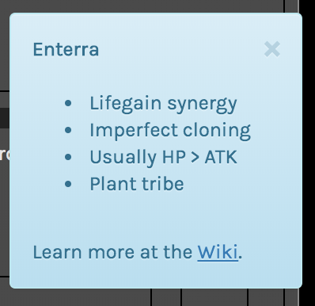

Realms are sets of cards that come from the same world and all landed on Wanderstar. Their type line will say "\<Tribe> from \<Realm>," ex: "Spider from Spideropolis."

### **[You can find a list of most of the Realms here!](/realms)**

---

## What are Realms?

When Realms get enough cards of certain rarities in them, they can get rewards -- either Age Completion rewards, or the chance to get a **Legendary** rarity card into the game.

Anyone can make a card for a Realm, and when you successfully submit a card belonging to a Realm you become a **Realm Member** However, if any of the **Realm Admins** (max 2) veto the card, it will not get in. **Realm Admins** also have the power to veto flavor or lore related changes to cards in their Realms.

## Realms are for Advanced Users

You cannot create a new Realm until you have successfully gotten a new card into the game. We recommend that you focus on that before even reading the rest of the information on Realms.

The information in this section is mostly meant for people who are developing Realms. Anyone can make a card which contributes to an existing realm by selecting it via a dropdown in the Card Creator, and when you select a Realm for your card, it will give you a brief explanation of what characteristics this realm has, so that you don't have to read all of the detailed information here. The explanation looks like this:

**If you are interested in contributing more heavily to a Realm or want to make your own, read ahead!**
