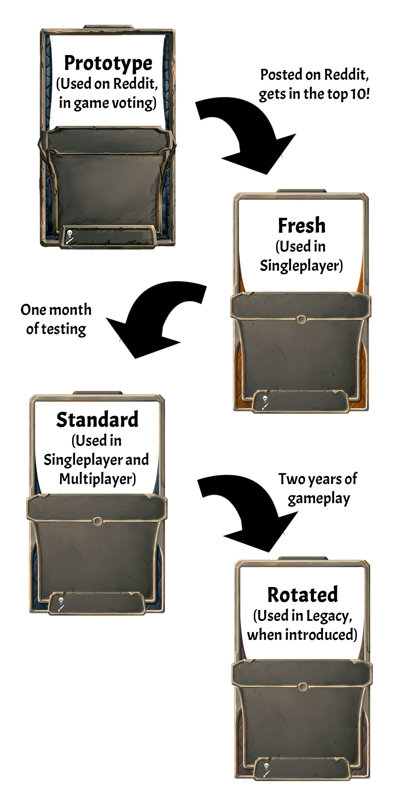

Each week, cards made by the community are added to the game. You can submit cards, too — but might want to read more about the specifics first.

---

## Weekly timeline

At **Wednesday Midnight PST (UTC-7)** every week, a new week of card submissions begins. Until exactly one week later, all cards The top 10 voted cards of each week are accepted into the game. A query utilizing Reddit's API ensures that the ordering reflects actual upvote amounts and takes vote fluctuation into account as well as possible.

## Categories of Submissions

Posts made to the [Subreddit](https://old.reddit.com/r/collectivecg/) which add or change cards in Collective must begin with a tag, such as [Card], or they will be disqualified. We want it to be extremely clear when someone is voting on a post to be added to the game, and the reason to keep it in the title is so that we can be sure it wasn't changed midway through the week.

Feel free to post whatever else you want on the [Subreddit](https://old.reddit.com/r/collectivecg/) as long as it’s related to Collective or tropical fruits.

Here are the tags and when to use them:

### [Card]

- New cards should be submitted with the [Card] tag and follow all the rules of any post in the [Subreddit](https://old.reddit.com/r/collectivecg/). The top 10 voted card submissions each week are accepted into the game.

- If there are not at least 20 posts, we roll the current week's cards into the next week. (This has never happened.)

### [Update]

- Updates must be submitted with the [Update] tag, and should have a change in the card's effect visible in the card's stats, numbers and/or effect. The top 3 voted update submissions with more votes than the 10th normal submission each week are accepted. (The max 3 updates have been nicknamed "update slots" by the community.)

- A fix to how a card works without changing the card's text itself, in order to match its function with its description, can be handled with a [Cosmetic Update] or a Dev Update instead.

### [Cosmetic Update]

- Cosmetic updates must be submitted with the [Cosmetic Update] tag, and should only change something that doesn't affect the card's gameplay significantly. For example, the art, the name of the card, its rarity, or its tribal type (even if there is a theoretical, minor change in gameplay significance). Minor bugfixes can also be Cosmetic Updates until (if) we start seeing bad actors who submit Cosmetic Updates to "sneak in" changes to cards.

- Affinity changes are not [Cosmetic Update]s. During discussions about Affinity Identities that prompted [this article](/blog/2019/02/21/affinity-grammar), we considered making them Cosmetic; if this becomes an issue again we might reconsider, but only if players had the intention of making changes that would not be sneaky balance tweaks. Even then, it's unlikely.

- Cosmetic updates with more votes than the 10th normal submission each week are accepted, with no slot limits.

### [Reprint]

You can resubmit a card as a [Reprint] if it has rotated out of the format. If it gets enough votes, it will replace one of the top 10 cards from that week. You can learn more about rotation [here](/blog/2019/12/08/rotation-2020).

## Votes

- Votes on cards are combined from two sources:
  - Reddit vote totals, collected by an automated script run Friday morning.
    - The script is run a few times, 15 minutes apart, and the Reddit vote totals are calculated by taking the average from every time the script is run.
  - In game vote totals
    - In some modes, players will be shown a set of four cards out which haven't been added to the game yet. They can choose one of these cards, try it out in game to see how it feels, then provide an up or down vote.
      - If a player has seen all cards visible on the [Subreddit](https://old.reddit.com/r/collectivecg/), they will see a set of four cards they have already voted on, along with their existing votes.
      - Playing modes which don't have in-game voting will provide "voting tickets," which allow players to vote on cards in the game's main menu.
      - We (the developers) have taken a page from Reddit and made a decision to keep the algorithms behind which cards are shown private.
    - In game votes are counted up Friday morning, and votes in game are each worth two Reddit votes.

### Side note: On in game voting

We have a policy not to go into details about the process by which we show your card (or don't) during in-game voting. We took a page from Reddit itself here, which is famously secretive about their algorithm and regularly makes changes to it.

We make a post every Tuesday with a preview of the week's progress titled "Week X so far." We do not show the performance of [Reprint]s in this post for technical reasons.

### Side note: Community Commentary

You can provide a message (up to 200 characters long) explaining why you made a card, and why it should go into the game. If it's accepted, your message will show up in game as "Community Commentary". See [here](https://www.collective.gg/library/blog/2019/12/22/commentary/) for more information.

### Side note: Flair in the Subreddit

Posts are assigned flair on the subreddit, but this is done manually by tweaking reddit automoderator settings and it is **not** how the script finds which cards are eligible for in-game voting and the final vote tally. The flairing process can have some issues but flair is entirely cosmetic, and we haven't seen any evidence that cards with improper flairing receive fewer votes. We try to get it right, but we don't have a responsibility to go back and re-flair posts which were labelled incorrectly. (Sometimes we do this anyway)

## Deadlines

On **Wednesday at midnight Pacific Standard Time**, a new week of submissions begins. Cards posted in the seven days before that are given a couple days to collect more votes on Reddit and in game, and the votes are tallied up on Friday morning PST.

At **Friday 10:00 am PST**, new cards are added to the game via an automated script.

## Submission Rewards

When your [Card] is accepted, contributors to the card get:

- A reward of gold (an in-game currency) split evenly among all contributors to the card
  - Cards which have bugs will receive 500 gold and not let into the game until their original creator fixes them
  - Cards which work correctly will receive 2000 gold
  - Cards with an especially impressive card logic ("blocks") will get 3000 gold
- The Blueprint of the card, which lets you include as many copies of the card as you want in any number of decks for any format where the card is valid.
- A special golden front for the card, and a unique animation which occurs when the card is played (and another unique animation when the card is played against the creator).

Updates and cosmetic updates which don't change the art significantly do not provide rewards.

## Card Lifecycle

The frame of a card shows its status and its availability in different modes. Here is a simplified diagram:

## Exceptional processes

### Bugfixes

If a card has bugs, the process right now is to report it, either with the in-game bug report functionality, reddit message, or discord direct message.

If you report a card as bugged and supply a fixed version, it makes things a lot easier for us, and we can (and often will) try your fixed version out and, if it's correct, update the bugged card with your fixed version.

If you don't know how to fix an issue yourself, don't worry. Reporting a card as bugged in the discord bug-reports channel often will be enough to get someone to fix it for you. Our community is very helpful :)

### QoL Updates

The developers reserve the right to modify cards should they cause technical or QoL ("Quality of Life") issues. We really don't want to affect balance with this at all, but sometimes we might. If you're curious what this looks like, [here](https://discordapp.com/channels/408505426787958784/408505426787958786/684860040070299822) was a casual conversation on discord where we did the first one of these.

### Sending to Limbo

If your card is accepted but cannot be added to the game yet, it may be put into "Limbo." Here are the reasons a card may be put in limbo:

- The card accidentally surfaces a bug or missing feature in the game. (One of the rules for new cards is that they cannot be intentionally designed around surfacing a bug or feature that you'd like us to make.) When the bug or missing feature is added, we will remove the card from Limbo.
- The card has a subtle, accidental bug in it which we don't have time to immediately fix. As soon as we fix the card, we will remove the card from Limbo.
- The card has a bug. When the original creator fixes the card, we will remove the card from Limbo.
  - We also may fix it ourselves if the original creator never fixes the card. We will wait four weeks before doing this, and even then, probably only do it when reminded to by the players.

When a card is in Limbo, it will be visible at https://www.collective.gg/cards but hidden in a section labelled "Limbo." While in Limbo, the card cannot be used in game.

### Deletion

If your card is found to be breaking one of the rules after it's gotten in, we may fully remove the card from the game. We've only had to do this once so far.
