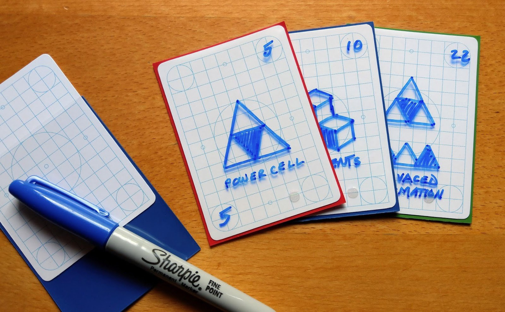
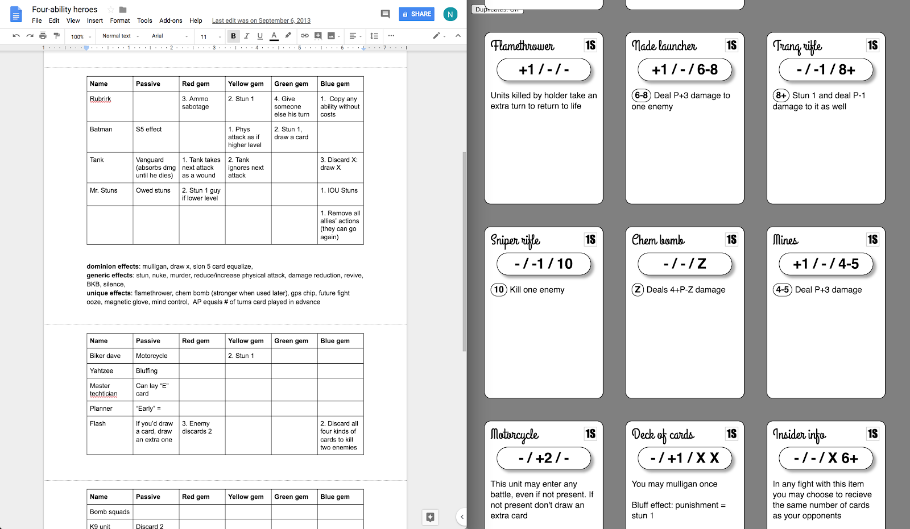
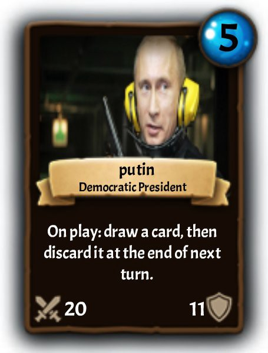
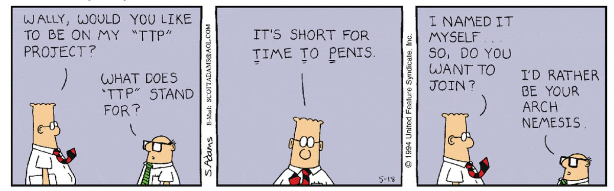

_Best photo we could find of me and Alec._

We at Odious Studios have been working on Collective for years. Here’s our story. (Next week, we’ll talk less about ourselves and more about Collective and games in general — this story is mostly for the fans who want to know our history.)

## How we met

Around 6 years ago Alec started casually working on a card game engine for fun. He and I (Nick) were friends in our college, University of California, Santa Barbara. We played a lot of card games together — mostly deckbuilders like Dominion, and sometimes Magic: the Gathering Online. I almost exclusively watched Alec and other friends play MTGO instead of getting an account himself, because I liked the game but hated the idea of paying for it. Eventually Alec made me start paying too, because that game is not cheap. Alec played lots of paper Magic, Hearthstone, Solforge and other card games.
After graduating, Alec worked at some software jobs and I worked at a board game store for a year while learning Unity for fun. Working in a board game store comes with a mandatory hobby of amateur game development, which took up a lot of my spare time. I infected Alec with this virus and he made a lot of paper prototypes too, although he had been programming small games since 2010.

_Let’s pretend it looked as nice as this stock photo._

## Early ideas

We playtested tons of wacky home-made card games using blank cards and sharpies. Here are some of the better ones:

- A moba-themed card game which featured semi-simultaneous turns based around attacking/farming/defending as a rock/paper/scissors mechanic on a 5x5 grid. If you ask me I could tell you more about this one, it was actually quite good.
- A deckbuilder game like Dominion which was played as fast as you could slap cards down. I’m still waiting for someone to make this, it was the most fun game we made during this time. Tip: it was fun because it involved physically slapping cards down, but it was way too easy to cheat, making it seem possibly better suited for a digital game.
- An extremely simple combination of Dominion and MTG, where you could spend Dominion’s money cards to buy more money cards, a Dominion card to improve your card drawing engine, or a MTG card, which was also paid for with money. Combat worked just like MTG. This worked surprisingly well with essentially no extra rules.
- Several prototypes of what would ultimately become the rules for Collective, which we’ll go into in the next section.

_Notes from our moba board game. I have no idea what anything on the left means._

Meanwhile Alec worked on the rules engine for his card game, still not sure if I would ever contribute more than just playtesting with him and giving game design advice. We made a lot of these card games when we were roommates from 2013–2015 or so, but Alec worked on the engine in his spare time between 2012–2017.

## Prototyping Collective’s game rules

A lot of our ideas for collective came from incorporating mechanics from deckbuilders, or mobas (which we also played together), into hearthstone/mtg gameplay. You can see the remnants of this in Collective’s current design. Here are some of our favorite memories of mechanics we scrapped:

- A land mana system like MTG, except the lands pay for card types instead of colors. We just used magic cards for this. To play a creature, you had to use a forests; to play a spell (sorcery or instant) you had to use mountains; to play an instant or a card with flash, you had to use an island; to play enchantments, you had to use a plains, and to play a planeswalker you had to use a swamp. I still love this idea but will admit it’s mostly because of its clever design, the gameplay wasn’t very different.
- A game where instead of paying mana costs for cards, you played them and a number of turns later equal to their mana cost, they came into play (essentially the Suspend mechanic from mtg). This led to gameplay where turns happened very quickly and you had to plan several turns in advance. All units also had a speed stat that determined how often they could attack or use an ability. This game also had simultaneous turns.
- A small adjustment to the rules of a game like hearthstone or magic by adding a moba-style farm/attack/defend rock/paper/scissors gameplay which theoretically worked well with simultaneous turns. Cards could do three things: directly attack (like in hearthstone), gain +1 mana, and block, all of which were decided simultaneously, as well as the ability to draw a card at any time for 3 mana. This involved direct attacks that could be blocked, which really made combat hard to predict. It showed early issues with decision paralysis created by essentially infinite possible ways turns could turn out, usually ended up with us getting impatient and choosing to just farm up a bunch of mana and then attack face with all or almost all of our units.
- Instead of MTG instants, we had an idea for a “trick” phase where cards resolve before the cards played in the play phase (hard to understand, and there was also no reason to play a trick outside of the trick phase).
- Three separate decks which you switched between when you levelled up. At level 1 you drew from your level 1 deck, then when you levelled up, you started drawing from your level 2 deck. This system eventually became our current “levelling up” system.
  We also had an idea for a color pie based on seasons. Here were the themes for each season:
- Spring: The [Golden Age](https://en.wikipedia.org/wiki/Golden_Age). Untamed nature, animism, abundance, preindustrial society, innocence.
- Summer: An age of heroes. Traditional fantasy, medieval aesthetics, monotheism, early adulthood.
- Fall: The decline of civilization. 20th (not 21st) century warfare, atheism, and greed. Aesthetics of middle-aged life. Essentially, world wars 1, 2, and the cold war.
- Winter: Science fiction. Interplanetary exploration, aliens, etc. Old age, and life extension technology. With interplanetary exploration and old age comes themes of starting over in an unspoiled world with a childlike view in Spring.

We ultimately opted for something much more open-ended in our current Strength/Spirit/Mind color pie, but I actually believe it lines up very closely with the seasons idea — Strength feels like Summer to me, Spirit like Spring and Winter like Mind. All of the above descriptors for the aesthetics fit with cards that users made on their own (with the biggest exception being all the fish cards in Mind, just because Mind is blue). Players universally rejected the idea of modern day themed cards, which all would have fallen into the “Fall” category. Recently, I suggested that we explicitly align our existing color pie with “past, present and future” times (revolving around the core set fantasy setting as the “present”) and the discord didn’t like it at all ¯\_(ツ)\_/¯

_We originally used assets from the Unity package [CCGKit](https://assetstore.unity.com/packages/templates/systems/ccg-kit-52739). Maybe we should go back to this style. It’s much cleaner. Thoughts?_

## Our first year working together

In mid-2017, the game’s engine was pretty solid but the card editor was 0% done, and there were literally zero art assets of any kind. The game was just white squares with Arial text on them, and only six cards were actually made at the time. I, still not sure if I would work on the project seriously, threw some stock assets into Alec’s existing Unity project and after only a week realized it was already playable and looked pretty good. That week I decided to drop all the other things I was working on and start taking Collective seriously.
Both Alec and I worked on Collective (didn’t have a name at the time) in our spare time after our full time jobs. We got a ton of feedback in late 2017 and early 2018 from people on the /r/custommagic and /r/customhearthstone subreddits, which was extremely valuable (more on this in a later, less egocentric blog post). In early 2018, we both shifted to part-time work, and eventually to working full-time on Collective. The entire project is bootstrapped.
We went to GDC in 2018 to talk with publishers and other game developers, and found the Portland Indie Game squad event to be the best event by far. This was a big part of why I eventually moved to Portland, and I’ve visited and participated game jams there. Their game jams are really good, [you should check them out](https://pigsquad.com/)!

_Early conversation between us and a game publisher, 2018 (colorized)_

Of the people at GDC we talked to,

- About 10–15% said “this sounds amazing and i want to play right now.”
- About 60% were politely interested. We’ll get them someday.
- About 30% thought it could never work because people would overload us with terrible cards and drawings of dicks. This is when we first heard about the metric TTP: “[Time to Penis](https://www.engadget.com/2009/03/24/overheard-gdc09-ttp-time-to-penis/).” We were assured that it would be nearly instantaneous. As a testament to our incredible fans, we still haven’t had someone submit a penis card to the subreddit. I’m choosing the word “incredible” intentionally — when we tell this to people in the games industry, they often respond, “I literally don’t believe you.” This is just one of the ways our fans blew away our expectations, which we’ll go into in a later blog post.

## Thanks for reading

That covers our history before early 2018. If you made it this far, thanks a lot for reading. This one is really for the fans; our future blog posts will be oriented more towards useful things we’ve learned instead of recounting the past.
