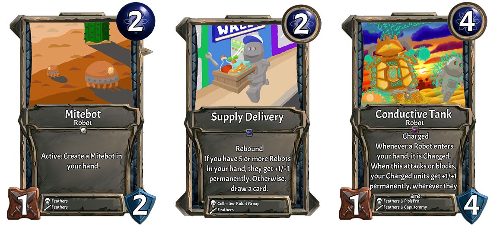
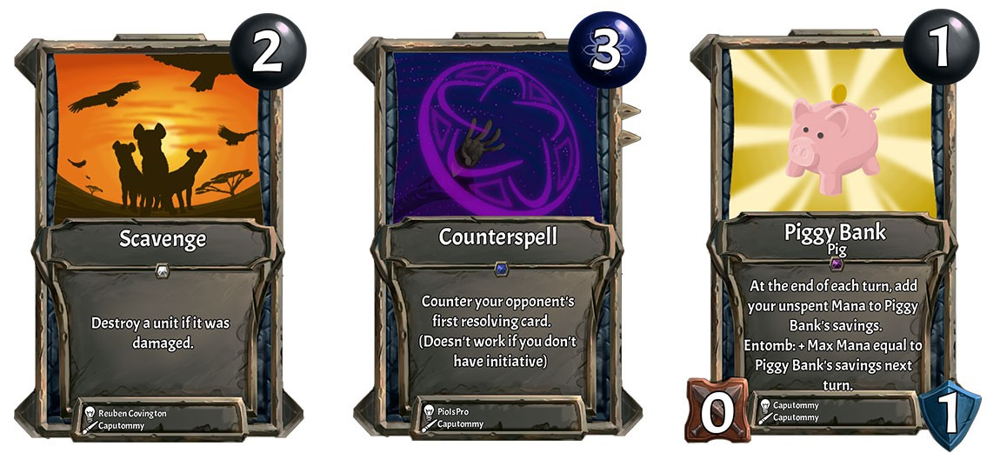
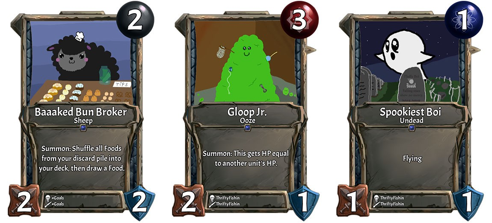
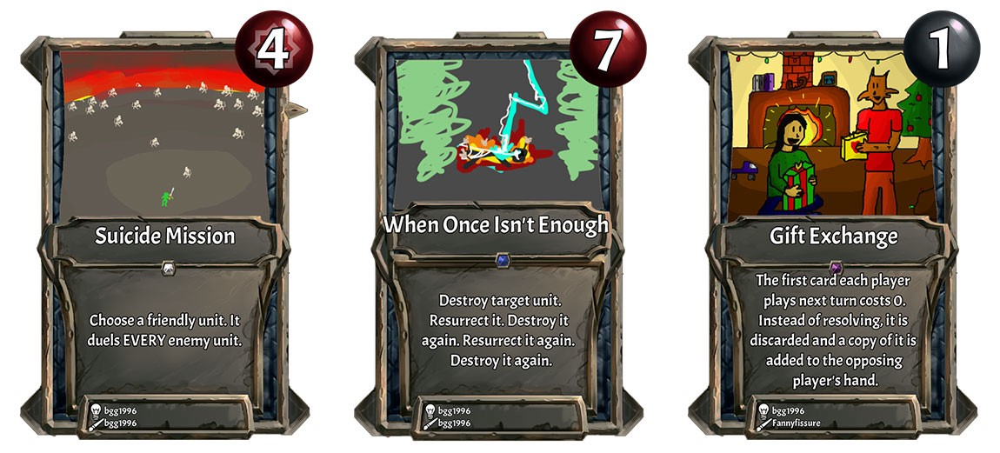
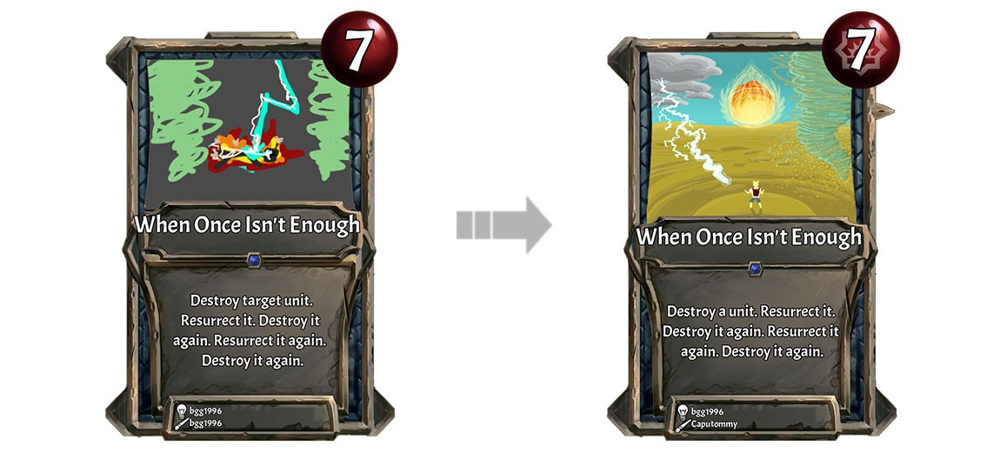
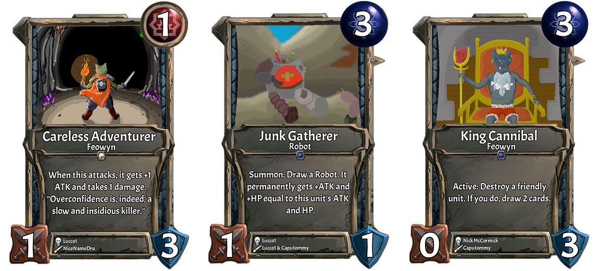

We learned a lot about what makes an appealing card in a CCG during the first few months of Collective. Because all new cards are player-generated and voted on in our Subreddit, card creators get immediate feedback (in comments and votes). Strategies for making great cards develop very quickly.

I chose examples here that should be easy to parse even if you don’t play Collective. The ideas here can be applicable to designing great cards for any CCG.

Note to creators: Don’t feel left out if you weren’t included! The people chosen here were mostly chosen because they have a consistent and long history demonstrating the strategy I’m highlighting. The purpose of this article is to inform card designers about some strategies on how to be appealing, not to be a “top 10” list of creators in Collective, so a lot of awesome people will get overlooked here.

## Contribute to an archetype: The Collective Robot Group

One of the ways our first group of users blew away our expectations was their ability to collaborate. Within the first two weeks of the alpha, creators formed into groups to collaborate on cohesive designs for a tribe or other archetype. The Collective Robot Group has been one of the most consistent over time, averaging about one card every two weeks since the start and successfully creating a deck archetype that’s competitive in the current meta (as highlighted in the meta breakdown Collector’s Net). They, like many other groups, have their own Discord server (not run by us) where they meet to design mechanical, thematic, and artistic synergy. From the cards here, you can already see mechanical synergies: Robots are a tribe in Mind (blue) which focus on creating small tokens in hand and buffing them before coming into play, a really cool midrange or lategame archetype which feels different from any other tribal synergy in other CCG’s. The group even appears to use a consistent color palette, using desaturated colors and focusing on orange, tan and blues as backgrounds, and shades of grey for the robots themselves. Some of the cards don’t fit in with this palette, but that’s because Robots are designed by committee, like everything else, and you have to play with the hand you’re dealt.

## Make fantastic art: Caputommy

Art has a gigantic impact on how much players like a card, and of all the ways the community has impressed us, their skill and dedication to art was the biggest surprise. During development of the Art Editor, we assumed virtually all cards would use our premade art and photoshop-style filters, and maybe layer multiple pieces of premade art. We were completely wrong — last week, for example, all cards added except for two used nothing except the drawing tool, and the premade art was only used as a background in both.

Caputommy has a well established position as an incredible artist during the short history of Collective, usually drawing at least one card each week, and has only gotten better over time. Art really matters when it comes to getting upvotes, particularly because Reddit is a visual medium, and the result is a game with extremely varied and beautiful pieces of art. Some players have even said that artists have an “unfair advantage” in terms of votes, especially when the alpha was just starting. To these people, I would suggest joining the Discord and either asking for established artists to make some great art for you, or just grabbing some premade art from the #art-sharing-🎨 channel, where artists put pieces they made just for fun without knowing what the effect will be. There’s still tons of great art there just waiting to be used!

## Create something viscerally appealing: Blaine AKA ThriftyFishin

This was a category I made specifically for Blaine, who has repeatedly shown that cuteness sells. Competitors like Hearthstone, Magic: the Gathering and Yu-Gi-Oh don’t seem to have a place for adorable little guys like Blaine consistently makes. Me and all the other voters are smitten with designs like this, and the fact that these get in alongside other, darker designs shows that players are interested in a wider range of styles than bigger CCG’s. Because our new cards are all player-made, Collective will inevitably will have a less consistent style than other games, but this also makes me think there’s a missing opportunity for CCG’s here.

Cuteness is consistently how Blaine makes popular cards, and he is another creator who has gotten cards into the game almost every week. However, you can go in a completely different direction, but if you make something that just makes people smile without being able to explain why, you’re on the right path.

## Design an amazing theme: Bgg1996

I’ll just say it: Bgg1996 is my favorite card designer. Different design strategies appeal to different people: like I’ve already said, some voters prioritize art, improvements to the meta, building up deck and tribal archetypes, etc. Bgg’s specialty is my favorite aspect of design: making cards that, using just the game mechanics, “feel” like they’re doing something novel.

The three cards here are all great example of cards which do exactly one thing, do something I’ve never seen in a card game before, and have accompanying names and art that do an excellent job of conveying the effect and nothing else. Picking a topic not traditionally found in CCG’s, like a friendly exchange of gifts, and designing the card to fit the theme is a great way to make a novel effect. (This process is known as “top down design.”) When balanced properly, creative effects with designs that begin with a novel theme can easily become the most upvoted cards of their week without fitting into an archetype, improving the meta, or showcasing art that took hours to make. And if your art wasn’t exactly amazing, artists like Caputommy may update it anyway, as was the case with When Once Isn’t Enough.

_Cards already in the game can have their art updated, and if the update gets enough votes, it’s added to the game without counting as one of the ten cards added each week. This is called a “Cosmetic Update” and skips the ten card limit because it has no impact on gameplay._

## Discuss your card with the players: Lucco1

_What comes up when you search “in: card-lab-🔬“ in Discord._

The last thing which took us by surprise is just how dedicated players are, and it really shows in the Discord. Just yesterday, over a thousand messages were posted in the #card-lab-🔬 channel in our discord. (It was about 1040). Most people in the current closed alpha check in occasionally on the subreddit or play a few games a week, but a small number of power users spend a huge amount of time on Discord crafting the game they play. Without these people, our game wouldn’t be close to as great as it is today, and their deep understanding of the game allows them to make cards that fit into Collective like missing pieces of a puzzle.

I could have picked a lot of people here, but Lucco1 stands out to me. None of these three cards were created entirely from Lucco’s imagination: instead, he worked with other players and existing rules of the game to make cards that improve on the game’s strengths and patch up its weaknesses. Here is specifically how each of these cards fit into the game:

Careless Adventurer’s reddit post has commentary from Lucco in the title: (was #1 last week but had to delete it because of a balance change done to Strength’s EXP). The card was the highest upvoted card the week before, but because of a balance change to Heldim (one of the game’s Heroes) Lucco deleted it and readjusted its effect to fit better into the hero’s new gameplay, and added a comment to the title so that subreddit readers understood exactly why the card had to be remade. Additionally, Lucco teamed up with NiceNameDru (another fantastic artist) via Discord to create the art for this card. We liked this card so much, we used it in our community trailer.

Junk Gatherer is a great addition to the Robot archetype, discussed earlier in this article. Lucco discussed the idea with the Robot Group before posting to get their go-ahead, and unlike many attempts to add to existing archetypes, did not expand the mechanics of the archetype at all, instead reinforcing what was already there. Lucco worked along with Caputommy to create the art, and even used a similar color palette to previous Robot cards.

King Cannibal was a card that I (Nick) made before the alpha opened up to more than a dozen people. The art was bad, and the effect was inconsistent with the way other “destroy one of your units for a reward” effects worked in the game. In Collective, if you don’t like something about a card, you can submit changes as an [Update], which is what Lucco did here. The reddit post contains the extra commentary: (New art + Changed how the card works, will now fail if the targeted unit dies before the effect resolves). Like Careless Adventurer, Lucco made it clear to voters in the title what was changing and why, and like I suggested earlier in this post, utilized another artists’ skill to guarantee that the card got into the game (Caputommy again!).

## Conclusion

No card is perfect in every way, and some of these strategies actually conflict with one another. Therefore, you shouldn’t consider these suggestions as a checklist when you’re making a card. Instead, I would recommend finding a strategy here that fits with your own talents, doing your research to make sure your idea fits, and working on the skill of making great cards. The voters are the ultimate judge, and from what we’ve seen so far, they have excellent taste.
Collective is in a closed alpha right now. We’re preparing the game for the next group of players right now, and if you sign up today you’ll be invited within a couple months.
