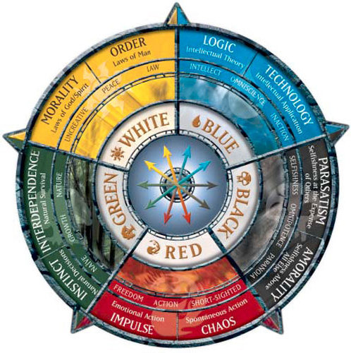
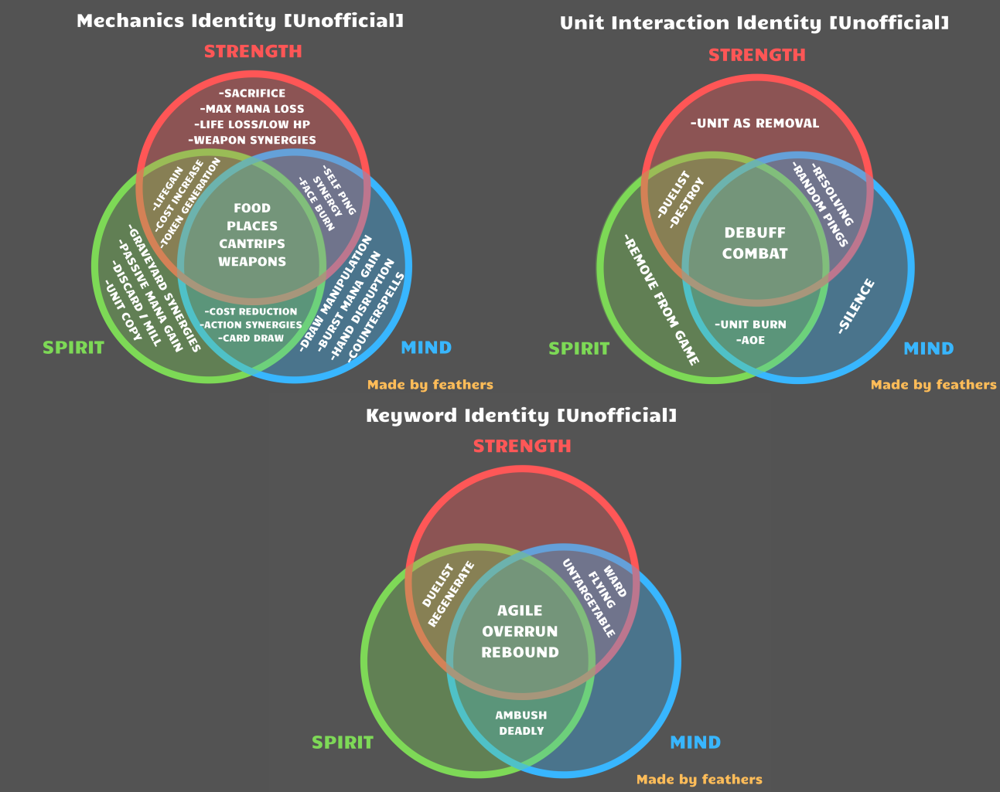

### The History of Affinity Identities in Collective

Originally our (deprecated) [FAQ page](https://collective.gg/faq#affinity), was even less instructive than what we have there right now, maybe a paragraph or two. People wanted us to "update" the page so we did and basically updated it to what people told us.

Over time, players asked for us to officially support some mechanical affinity identities. We created the #affinity-identities channel in [Discord](https://discord.gg/C8fTNVt) so that people could begin to collaborate on some rules, but basically stayed away, because to be honest, we never wanted them to be strict at all. You can see this in what we wrote years ago on /faq:

> However, these are guidelines we've set in the Core Set, and we strongly want to avoid a mechanically restrictive color system. Feel free to make cards which break these rules and see if people on the [Subreddit](https://old.reddit.com/r/collectivecg/) like your idea. The important thing is to tie it to the 'feeling' of the affinity, and players should decide what that means.

Since the beginning of Collective, we found /r/custommagic to be a big positive inspiration with two caveats: basically, we hated how many of the comments there were nitpicks about grammar or color identities. But these comments are actually good for /r/custommagic. Here's why:

_Magic: the Gathering color pie. https://mtg.gamepedia.com/Color_

### Why it's good to have color identities and strict grammar templating in a community like /r/custommagic

In Magic: the Gathering, it's good to be extremely explicit about every single effect because the game is played with pieces of paper in person. If something is ambiguous there is no computer to tell you how things should play out. Additionally a lot of people at /r/custommagic want to be Magic card designers, and making a mistake (and they are in fact mistakes) in grammar/templating is something many of them would love to be corrected on.

The color pie is a very similar set of rules. It's an [insanely detailed system](https://magic.wizards.com/en/articles/archive/making-magic/mechanical-color-pie-2017-2017-06-05) which makes distinctions as granular as "+N/+0 (on Auras) are a tertiary effect in Green." If you expand everything on that page, **it's 81 pages long.** It's this detailed because it really matters: breaking the color pie is a "mistake" if you want to be a Magic card designer. Wizards uses people's interest in making Magic cards as a PR stunt in the [great designer search](https://magic.wizards.com/en/articles/archive/great-designer-search-2006-08-21), a set of over a dozen (!) articles which effectively play out like The Apprentice but for Magic card designers. People who are way into Magic follow these to learn more about the mentality that goes into designing their favorite game.

## Why it's good to have color identities in Magic: the Gathering

Why is the color pie good in Magic? There's a lot of reasons, but some of them are specific to Magic (and extremely similar games like Eternal). These are the ones I know of:

> ### Colors of untapped lands tell you how your opponent could respond
>
> In Magic, when you leave lands untapped your opponent can see them and predict what kind of effect you might have. Because Magic has instants, you need to check if your opponent has green lands untapped in case you attack into them on your turn, because they can buff one of their creatures and win a block you thought they would lose; there are effects like this in every color, with the most famous being blue lands representing a possible counterspell. However, you can also form a general strategy against someone who has only played certain colors of lands by the end of the game; especially if you know the meta or the limited set of cards they're drawing from, you can plan ahead and predict their plays. Simple rules such as "green doesn't have fliers" or "black can't destroy artifacts" let you know how to use your cards against different opponents.
>
> ### Color restrictions are the primary reason that decks are different
>
> Aside from colors, there is nothing to distinguish one deck's possible plays from another, so the color pie is not just helpful in defining the identity of a deck; it's the only thing that defines it. (OK, not really, the other thing defining a deck beyond simply being "a pile of the best cards in the game which retains a good mana curve" is interactions between cards.)
>
> ### Color pie 'breaks' have permanent effects which can't be undone in a physical card game
>
> Cards printed in a specific color can essentially never be undone; if something breaks the color pie, the only way to undo this decision is to ban the card. This is seen as a desperate measure to fix a major mistake, and generally, people dislike it when this happens. This is also because Magic is a physical card game first (for now) and if someone has a piece of paper which says they can do something, it's not a fun experience for someone else to look online and tell them that their card is "illegal."
>
> ### Working within the existing color pie is a fun challenge
>
> People who play Magic and other games with similar color pie systems have become extremely enamored with the strict rules of the color pie; they like creative implementations of the color pie, whereas breaks from the color pie are controversial; some people are happy to get new abilities, but others dislike that the system they know has been distorted, and may be equally unhappy that players get access to that new ability.
>
> ### Deckbuilding is more interesting when taking into account your 'curve' across multiple colors
>
> Sometimes the thing preventing a deck from breaking the meta is that they have to play bad mana bases to play all of the cards that make up their game plan. The random nature of drawing lands means that sometimes players won't get the lands required to play their cards, and lands which can tap for multiple kinds of mana almost always have some drawback or another, making interesting deckbuilding tradeoffs. This is magnified by the statistics involved in drawing lands; the math behind this is constantly being investigated, and simple heuristics like "it's better to 'splash' cards if they cost more" are the result of complicated statistics.
>
> ### The colors have a 'feeling'
>
> It's nice to have a color "feel" like something, and mechanics are a way to represent the "feeling" of something in gameplay terms. Colors also have thematic identities (goblins, dragons and burn spells in red) which help with the "feeling" of a color.

## How does this apply to collective? (Grammar)

As far as grammar goes, simply put, a discussion about grammar on a [Subreddit](https://old.reddit.com/r/collectivecg/) distracts from the real point of the [Subreddit](https://old.reddit.com/r/collectivecg/) voting system.

Additionally, because grammar is decided via player consensus on [Discord](https://discord.gg/C8fTNVt) in the #grammar-time channel, there is no official stance on what is and isn't correct grammar. This means that a discussion on the [Subreddit](https://old.reddit.com/r/collectivecg/) would end up scattered across dozens of cards and extremely hard to synthesize into a definite ruleset; so comments on the [Subreddit](https://old.reddit.com/r/collectivecg/) on grammar are ultimately nitpicks that are ineffective in enforcing templating, whether well-intentioned or not (as opposed to discussions on the #grammar-time channel, which can be read or ignored at your leisure).

People interested in normalizing grammar can and have worked very hard to keep in mind the concerns of the entire community, as well as our input regarding technical aspects and upcoming features, and we're very appreciative of them. Ultimately we take a hands-off approach and if the community agrees on a change, we are fine with modifying the grammar of existing cards and will skip the voting system for such a niche and wide change to the whole set of cards.

## How does this apply to collective? (Color identities/Affinity)

The affinity system was something we designed with a variety of goals in mind, and we're really happy with how they turned out. The goals of the affinity system were:

- Accomplishing some of the goals of Magic's color pie system in a simple way. A somewhat accidental success of our color pie is that the themes were apparently clear enough that [players ended up aligning new cards with the themes without us having to enforce any rules](https://medium.com/collective-card-game-blog/sharpies-and-blank-cards-how-we-designed-collective-3a974f1cd4f2#da59).
- To create a color pie system which is "unbreakable" to prevent the game from eventually making it pointless, enforcing a punishment to playing a card that's not in your color. Unlike in Magic, the color pie cannot be permanently nullified by the players creating a land-type card which makes any color of mana without enough of a drawback. (This actually worried us about [rainbow prism](https://files.collective.gg/p/cards/00e0b250-2b29-11e9-8328-6343e26ccc8e-s.png) but we're holding off on doing anything about it for now, it doesn't seem anywhere near "affinity destroying.")
- Tying cards to Heroes, which have an affinity requirement that should naturally create interesting play strategies along with cards that are cheapest in their own colors.

With that in mind, lets see how the above reasons that a color pie is good in a game like Magic apply here.

> ### Colors of untapped lands tell you how your opponent could respond
>
> This is not how the mana system in Collective works. Because mana itself is not associated with an Affinity, there is no time like in Magic where your opponent is unable to play cards of a particular color because they have no access to mana of that color.
>
> ### Color restrictions are the primary reason that decks are different
>
> The role of Heroes in Collective also has a major impact on the difference between decks; additionally, cards from both affinities other than that of your Hero have the same penalties, so adding cards from a second color is punished to the same degree as adding cards from a third color.
>
> ### Color pie 'breaks' have permanent effects which can't be undone in a physical card game
>
> This is not the case in Collective; using [Update]s players can vote in changes to the effects of cards and they will change the way those cards work across the entire game.
>
> ### Working within the existing color pie is a fun challenge
>
> This is at the very least different; the challenge is to create and establish a color pie and then enforce it. Because of Collective's democratic aspect, this is very difficult.
>
> ### Deckbuilding is more interesting when taking into account your 'curve' across multiple colors
>
> The complexity of this gameplay is dramatically reduced due to Collective not using lands, three Affinities instead of five colors, and the ability to pay cards from other Affinities at a penalty.

Many of these don't apply whatsoever in Collective, and the things which still apply are not as significant. Because almost every card can be played in any affinity at a higher mana cost, you have no idea what kind of effect your opponent will play next. This unpredictability is made even more extreme by drafting from every card ever made multiple times during the game. Your deck is meant to synergize with your Hero first and foremost, so Affinities do not need to be as strictly defined as colors in Magic. Additionally, cards which restrict the color pie can be updated, and even in the case of core set cards, i've made it clear that we're OK with changing their affinity once the community decides on something.

> ### The colors have a 'feeling'
>
> As far as colors 'feeling' like something thematically, we're all for it. This is explained earlier in this post. We're very happy with these themes which have naturally risen from the "feelings" of the colors and their names (spirit/strength/mind):

- Past / present / future

- [Golden age](https://en.wikipedia.org/wiki/Golden_Age) / [fantasy "present"](https://en.wikipedia.org/wiki/Fantasy) / science fiction

- "Zerg" / "Terran" / "Protoss"

- Animals / humanoids / transhumanists as the dominant species of their homeworld

We're even happier that we didn't have to enforce anything to get there.

When it comes to colors having a mechanical identity, we're OK with it, but not nearly as enthusiastic as many people seem to be. Lots of players really want this, and our belief is genuinely that the primary reason people want this is that other games have it. Rules like "spirit doesn't have fliers" are becoming patterns in collective, but we don't fully understand what the justification is – the vast majority of cards which have flying are still available to be played in spirit, and even if the cost increase is punishing enough that you wouldn't play them, you are still moderately likely to get one in a draft and play it if it's beneficial in that situation. This doesn't mean that affinities are mechanically meaningless, more that the main time period where mechanical affinity identities actually have an impact on the game are the first few turns, especially the turns before a player drafts for the first time.

_An awesome set of diagrams representing player-created affinity identities, as of September 2019. For more information, check out the pinned post in the #affinity-identities channel on our [Discord](https://discord.gg/C8fTNVt)._

The tagline is "The Community Created Card Game," and if people want mechanical restrictions for affinities, that's fine. We want players to think hard about why they matter in Collective specifically, because like I said before, the vast majority of reasons to have mechanical restrictions are at the very least less important in Collective than in Magic or Eternal, and synergy with a Hero has a dramatically larger impact on gameplay than mechanical restrictions could have (especially after the early game). We have to enforce some limits when running Collective, and we generally place a high importance on creating a friendly space for players to create a silly card and post it without having people nitpick like they (justifiably) do in /r/custommagic. This is why it is [actually against the rules](https://old.reddit.com/r/collectivecg/comments/8ol49x/submission_rules_and_guidelines/) to comment on grammar/templating when someone makes a card.

If the community wants mechanical restrictions for affinities, we encourage it – just like how we encourage players to make whatever new cards they think appropriate for the game. We need for them to be very, very easily understood before we would support them officially (for example, with reminder popups in the card creator). Clear distinctions between "hard" and "soft" affinity restrictions would also be a positive step, because the complexity of affinity restrictions can spiral wildly out of control into an 81 page long document if unchecked. (The image above is pretty complicated, but certainly a far cry from the level of complexity found in the Magic color pie.) If complexity continues to increase and we feel that discussions become too nitpicky, we may have to start enforcing similar rules to the "no grammar discussion in comments" rules on affinity identities. With three free update slots a week, it will be easier than ever to change a card's affinity to whatever you believe to be the "correct" one after it's been posted, and it's up to the voters to agree or disagree.

_This is an updated version of a post originally made on the [Subreddit](https://old.reddit.com/r/collectivecg/) [here](https://old.reddit.com/r/collectivecg/comments/ata0ci/dont_upvote_pros_and_cons_of_thematic_and/) and the discussion in the comments there is great as well. Thanks Tahazzar._
