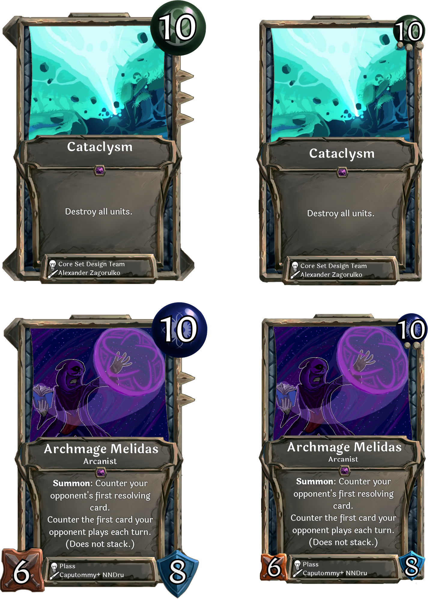

We've released a big update to our website and the Card Creator. The main features are:
* The Library - a new section where we've centralized card submission, card update, and community rules, along with some extra documentation about the card editor.
* Card frame update - We're changing how cards look so they're more rectangular. This won't be in the game until the next patch, but you can already see it in the Creator.
* Collection - Searches are now saved in the URL so they're shareable.
* https://www.collective.gg/realms - We don't link to this anywhere yet, but it contains up to date info on all the Realms.
* A fancy new top menu bar

The Library section of the website is open-source and available on GitHub [here](https://github.com/collectivecardgame/library/).

### Card Frame Before and After

