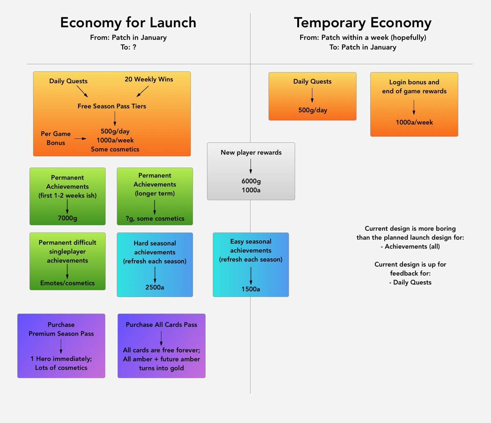
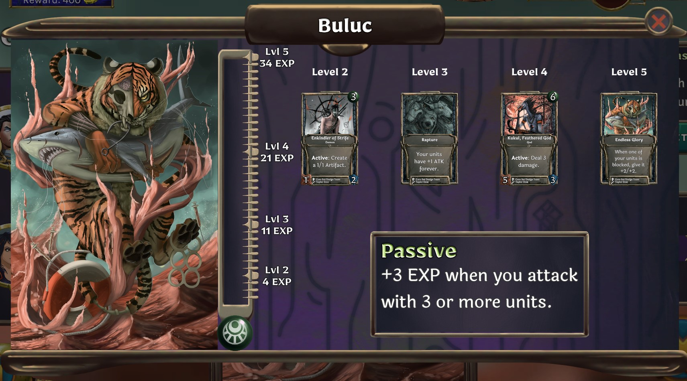
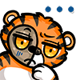

Hi, I'm Alec. I'm the main programmer and economy designer for Collective. In this post I'll explain our basic plan for the economy/monetization. Real transparency is important to us and necessary for a small, independent, community focused game like Collective.

The most important thing for us to communicate is that we essentially procrastinated on planning the details of the economy and monetization until we finally got to planning out this upcoming patch. To people who ask for more information about the economy: every time you asked, we also wanted to know what it would end up being. There was a general plan, but we tweaked or totally reworked it about once a month for at least the last year, based on a ton of different factors and potential features for the game. The low points of the existing economy get the spotlight in community discussions (which is totally fair), but there are also times when we threw a huge amount of currency into the game all at once, like with the tournament rewards or incursion levels.

The game is launching on Steam in a couple months and we're finally ready to provide details on the economy and monetization. Additionally, we'll be releasing a patch soon (at best, within a week!) which will feature a simplified version of the economy that will be playable immediately. You can see a quick overview of the differences between the simplified economy and the Steam launch economy in the diagram below.

This is a pretty big post because it's a rough draft for a later post (which won't have to explain the whole 'simplified economy' thing that will only be around until the next patch), and it will clearly explain our economy. This will probably end up a set of pages in the library, not just a blog post.

## Immediate Fixes

Right now the economy is in a bad state. The single biggest issue is that new players get almost no Amber or Gold to work with, so we're going to try to fix that very soon with a patch that adds an early version of the Achievements system. A second wave of achievements will be released in January, and some of the objectives may be tweaked over time. Existing players will be able to take advantage of the new achievements and get a large amount of Gold and Amber.

We're also going to make Dhat the starting Spirit hero, so that there's some playstyle diversity in the starting heroes. Anyone who already owns Dhat will get Buluc.

## The Numbers-only View of the Final Economy

A deck of 5 commons, 5 uncommons, and 5 rares will cost 2125 Amber (remember, blueprints mean you don't pay for multiple copies of a card). At the time of writing most of the top decks on the leaderboard cost much less than that. The community controls the rarity and effects of cards, so the Amber cost of a meta deck will shift over time.

### Continuous Rewards

A player will earn an average of 500 Gold per day if they complete their daily quests. This is enough to buy a Hero every 20 days. If that seems slow, consider that it's more than twice as fast as we release Heroes, since we'll release a new Hero every 1.5 months.

Players can expect to earn 1000 Amber per week from completing daily quests and playing games. That's enough to buy a completely new competitive deck every two weeks (in most cases). The seasonal achievements will be worth around 4000 Amber, and a new set of them will replace the previous set every 3 months (so you can get the 4000 Amber again).

(Note: Once the Season Pass is implemented, "from daily quests" actually means "from completing tiers of the Season Pass via daily quests")

In the January patch, we'll be removing the login bonus system and moving the Amber you would get from that into the Free Season Pass.

### New Players

A new player will finish a set of achievements and quests in their first 2-3 days which provides them with about 6000 Gold and 1000 Amber. This is enough Gold to buy Vriktik; if they don't buy Vriktik, they can expect to get to 10,000 Gold in 5-7 days total, and buy any Hero they want. They'll also earn approximately 1500 Amber from the "easier" seasonal achievements, giving them more than enough to build a competitive deck. A set of permanent Achievements in the next 1-2 weeks after that will give another 7K+ Gold. When combined with daily quests this gives enough for a second Hero.

## Details of the Economy

Much of this section is stuff you already know, either from playing the game or other discussions.

### Currencies

- Marbles - Purchased with real money. \$10/€10 = 1000 Marbles.[^1]

- Gold - Free currency that can be used for most items

- Amber - Used to buy cards.

### Gameplay Affecting Items

#### Cards

- Common - 50 Amber

- Uncommon - 100 Amber

- Rare - 275 Amber

- Legendary - 325 Amber (there are very few legendary cards)

**The primary way to get cards in Collective is buying them outright with Amber.** That means when we're talking about earning cards, we're really talking about earning Amber. We don't sell card packs (or other forms of lootboxes). When you buy a card with Amber, you get the card's "blueprint", which allows you to make any number of copies of it, in any number of decks. Blueprints can't be destroyed once purchased.

A lot of people like cracking packs, so we may add "Blueprint Packs" at some point in the future, but we won't charge money for them. (This approach is also shared by [Riot's upcoming card game](https://outof.cards/legends-of-runeterra/409-a-guide-to-legends-of-runeterra-for-hearthstone-players).) In-game drafts have a small chance to be a Blueprint Draft, where you immediately get the blueprint of whatever card you pick.

#### All Cards Pass

For voracious deckbuilders, we're also going to offer a \$30 USD All Cards Pass: a one-time purchase of all the cards in the game, including all future cards. Players who own the All Cards Pass will have their current and future Amber converted to Gold one-to-one, and half the Amber value of their existing blueprints at time of purchase converted to Gold.

This is an idea from one of our players that we liked, and decided to go with it after running it by some of the people who have been with us since early in the Alpha. Whether it's about the economy or anything else, Nick always loves hearing ideas from players -- if you have any, feel free to run them by him.

#### Heroes

10,000 Gold or 1000 Marbles - some will cost less.

A Hero serves as your avatar in a match, and as the focus point for your deck. As Heroes gain EXP throughout each match, they level up and get Hero-specific rewards with a powerful in-game effect. Heroes have an Affinity: Strength, Spirit, or Mind. Cards also have an Affinity (or are neutral), and cards that don't match your Hero's Affinity cost 1 more mana. A few cards are exclusive to Heroes of a particular Affinity. **The main value of a Hero is synergy with cards in your deck.** You can play almost any card with any Hero. I'm emphasizing this point here because players coming from Hearthstone sometimes think not owning a Hero means being locked out of an entire class's worth of cards. After a few hours of playing, you will have access to one hero from all three Affinities.

We plan to release a new Hero every ~1.5 months after launching on Steam. One common criticism of Hero systems in other games, e.g. League of Legends, is that new Heroes are often OP. We'll always attempt to balance the Heroes, but I'll say now it's very difficult for us to do that top-down, because the community has control over what cards are in the game. Our primary goal when designing a new Hero is to create something with a novel playstyle or deckbuilding angle. We expect it will sometimes take a couple months for the community to print the cards to support a new Hero, or for the meta to otherwise adjust appropriately.

#### Astral Gauntlet

1,500 Gold or 150 Marbles per run

AG is our version of a Limited mode. Entering with Gold will pay out prizes in a combination of Gold and Amber. Entering with Marbles will pay out prizes in Marbles.

#### Deck Slots

2000 Gold or 200 Marbles

Each hero starts with 3 deck slots, and more can be purchased. Each deck slot has its own rank on the leaderboard.

### Cosmetics

Most cosmetics will be purchasable with Gold or Marbles, but will generally be "cheaper" with Marbles. We don't have pricing set for all of these yet since we're still developing them.

- Hero Skins

  Hero skins change the appearance of your Hero and/or their reward cards. These are expensive and time consuming for us to produce, so there probably won't be that many at first.

- Emotes - 2500 Gold or 200 Marbles

    

  Used to communicate in-match with your opponent.

  Because these are how you will communicate, we are going to make a lot of these, and they'll be common rewards in the Free and Premium Season Pass tiers.

- Game Boards

  By default, matches are played on a board specific to the game mode you're playing. This can be customized by buying game boards. This is another area where we are predicting a high variance of monetary and design investment, and therefore a high variance of cost.

- Card Backs

  These customize what the back of your cards look like in a match.

- Card Frames

  These customize the front frame of cards. They are purchased and applied per-blueprint. Once we've made a few of these, they'll show up sometimes in in-match drafts, just like blueprint drafts.

  We already provide a kind of Card Frame for the creators of a card -- the Golden frame. These are applied to cards without choice right now, but we will make it optional to show this in the future.

- Alternate Card Art (later)

  We're not sure about the pricing on this, but the plan is to sell the ability to use card art from a previous version of the card, before it was updated. This logically follows as part of a longer term feature where people can see the update history of any card. We have the data backed up, but going through it all is quite a lot of work.

  If you owned the blueprint at the time the card was updated, you'll receive the alternate art for free.

### Premium Card Creator Features

We have mentioned these in the past, but unfortunately we don't have more details on this than what we've already discussed. We had to prioritize features necessary for the launch, and this was something we are putting off until after the game is on Steam.

What we've already said is most of what we've planned: when you buy the Premium Battle Pass, you'll get 3 months of access to the Premium Card Creator, starting the day you buy it. There will also be ways to access the Premium Card Creator with gold (1-day passes, 7-day passes, 1-month passes, etc).

This may have been said in passing, or maybe even not publicly, but we are committing to never gating any mechanical features to the Premium Card Creator. All features you get with it will be purely cosmetic (new animations, for example).[^2]

The Premium Card Creator was honestly the last thing on our mind when writing this blog post, so it's not in the diagrams or any other sections. We're planning on updating this later with more information.

## Gameplay Mechanisms for Getting Items

Every ~3 months will be a new season for Collective. At the start of each season, we'll be releasing a new Hero, new achievements, and a new Season Pass (Free and Premium tracks).

### Achievements

Achievements are one-time accomplishments that earn you a big chunk of Gold and/or Amber. The new player experience will be guided by achievements. Each season will also have its own achievements that award a large amount of Amber, designed to allow returning players to immediately build decks quickly and catch up with the meta since they left. New seasons are also when we'll market the game most heavily.

### Season Pass

**Nice preview picture goes here once I have it working in-game 😅**

1000 Marbles to Unlock Premium track & the Season Pass' featured Hero

The basic format of the Season Pass will be familiar to most gamers. As players complete Daily Quests and win games they'll earn Season Points (SP), which will complete tiers of the Pass. Each completed tier gives a reward to the player. The free track provides Gold, Amber, or an Emote at each tier. Players can purchase the Premium Season Pass to earn additional cosmetic rewards at each tier.

Rewards for owning the premium pass:

- Immediately unlock the Hero released at the beginning of the season.

  - Yes, that means you get the Hero and the premium pass for the price of a Hero.

- Dozens of cosmetic rewards (see above Cosmetics section)

- Earn up to 1000 Marbles by completing the Pass. Go infinite!

#### Season Pass Completion

The first season pass will have around 60 tiers.

Q: If I buy the Premium Season Pass, am I buying a part time job for 3 months?

A: It takes about 60 daily quests, plus the games you'd be playing to complete these quests, to finish the season pass. If you're efficient, you could play for as little as four hours a week and complete the Pass.

Q: What happens when I finish the Season Pass?

A: You'll be placed on the Off-Season Pass, which only has a free track, and gives Gold and Amber at a similar rate to the Season Pass.

### Daily Quests & Weekly Wins

The daily quest system is similar to that of other card games. Each day, you get a daily quest. You can store up to 3, and re-roll one per day. A significant amount of the daily quests can be completed in singleplayer modes. Daily quests award Season Points.

Your first 15 multiplayer game wins per week ~~in any mode (including single player modes)~~ will also award SP. We don't want players to feel like playing after finishing their quests is pointless, but also don't want people to get burnt out.

Edit 1/3/2020 - Only multiplayer games will count towards weekly wins, but Colosseum and Sentinels will continue to award gold and amber at approximately the same rate as the season pass. Less than 20% of the possible SP earned each week comes from weekly wins.

Every game you play will award some Amber, as well.

## What Informed the Economy Design?

### Early Ideas

All digital CCGs live in the shadow of Hearthstone. When it came out back in 2014, I was roommates with Nick in our college town, working on an early version of Collective in my spare time. For a good while I regretted not getting Collective, or whatever it would have been, out sooner. Much of the design behind Collective and its economy comes from games we played together. Dominion, Magic: the Gathering Online, Smash Bros and League of Legends were easily the top four, and for fans of those games, the influence of all of them (aside from Smash) can be seen quickly. Me and Nick got to know each other better by making paper prototypes of board and card games (you can read more about this [here](/blog/2018/09/25/sharpies-and-blank-cards/)). I had forgotten about this, but Nick reminded of something I said after we had just come up with a particularly clever mechanic: "I wish we could make a game that was as fun as it is to create these games."

Early in the development of Collective (around when Nick joined), we discussed a lot of ideas for an economy. Having already come up with the idea of user-created cards voted on within Reddit, the basics of the final game were in place.

We both played a lot of Magic Online, so we had to at least consider a similar economic model. This was the model that Valve's Artifact ended up with. Nick wrote a [very extensive blog post](https://medium.com/nickmccoblog/how-magic-the-gathering-or-artifact-could-crash-dc39ebfdcdc0) (written a month before Artifact came out!) about some potential pitfalls with this model, and give a good explanation of why we never took it too seriously.

Most people we talked to when we were getting started told us to sell packs. People still tell us to switch to a pack model to this day, because it's pretty common and is proven to be very profitable. I was always against this idea, for a few reasons:

- Players make the cards in Collective. Pitting financial incentives of designers against players is a recipe for disaster (for example, players could want to keep rarities generally low to make the game more affordable).
- Packs are the prototypical lootboxes, and lootboxes are very manipulative.
  - Nick proposed the idea of selling packs in early 2017, before the peak of anti-lootbox backlash. I was always agains this idea. Late 2017 through 2018 saw a massive shift of opinion away from lootboxes -- we're very glad that we made the right call.[^3]
- Our voting takes place on Reddit. Historically, Reddit can be a powerful force in organizing public opinion on business models, design decisions, etc. This was demonstrated in unprecedented fashion during this period of late 2017 through 2018, where, by our count, at least five huge AAA games suffered massive backlash from the players that seriously hurt or downright ended the games. This kind of community backlash against some of the biggest titles in a year was basically unprecedented in the industry, and Reddit was always ground zero for this backlash. It only makes sense that we would benefit most from a relatively generous business model free of randomness given the game we're making, and we're very happy to be in the right place at the right time.

Nick was the one who was really excited about a "Battle Pass" model. Fortnite is honestly a bit after our time, but the model seemed like a great way to provide a "Free to Play Premium" level of experience to the largest number of players. The most important thing for a CCG, especially an independent little one like this, is for us to grow in size. The Pass provides cosmetics that we had a lot of fun designing, and it makes them accessible to the largest number of people, in exchange for regular, moderate playtime. Encouraging more play without burning players out is our top priority.

### How Does Collective Compare to Other Games?

Check out [this article](https://rngeternal.com/2017/10/01/going-deep-free-est-to-play/) for an in-depth (albeit slightly dated) comparison of other F2P card game economies.

The average competitive deck in other card games seems to cost $50-150, and the cost of owning 4 meta decks comes in around $250-450. In Collective, the cost of a deck isn't more than $10 for the Hero, plus some time to farm the Amber. The cost of owning 4 meta decks, in the most expensive scenario, would be $70 (\$30 for the All Cards Pass + 4 new Heroes).

As a pure F2P player, it can take between 150-2,000 game wins to build a meta deck in other games. Yes, I know that's a crazy wide range; see the _Feeling the Grind_ section of the above article. In Collective it will take about 100 (5 games per day for 20 days), assuming you're starting from nothing and aren't taking achievements and new player rewards into account. Many quests can be beaten in single player modes, unlike most other card games.

When making Collective, we came at it from a similar place as many of the current players. We've played a lot of F2P games, and we wanted to make something generous and transparent, with a good balance of having plenty to do without feeling like you're not getting anywhere.

See you in queue!

[^1]: Obviously a dollar and a euro aren't equal in value, but Apple and Google (not sure about Steam) actually restrict how we can price our in-game purchases so they have to be round amounts. Also, USD and the Euro are getting closer to one another, [right now 1 USD is worth .90 euro](https://www.xe.com/currencycharts/?from=USD&to=EUR&view=10Y)
[^2]: There is a possible exception to Premium Card Creator features being purely cosmetic. This is quite a ways off, but we have ideas for some very silly effects which would be mechanical, but would only be allowed on cards with the theoretical upcoming "Joke Rarity" feature. An unfunny example of a "Joke Rarity" card would be: "Weekend Warrior," a card which has agile and +1/+1 if you play it on Saturday or Sunday. Cards with the "Joke Rarity" would not be legal in any format but might, very rarely, show up in a mid-game draft in casual formats like single player, or friends list matches (maybe?). This whole feature is still dubious.
[^3]: For those curious, MTG actually got the "lootbox" model from sports cards, and the somewhat outdated [United States legislation](https://leginfo.legislature.ca.gov/faces/codes_displayText.xhtml?chapter=9.&part=1.&lawCode=PEN&title=9.) makes special cases for "sports trading cards." Their term for a lootbox is a "Sports trading card grab bag."
