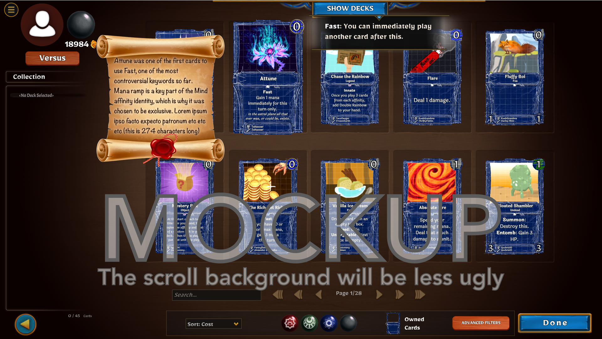

## Link to the sheet

[Community Commentary (Google Sheets)](https://docs.google.com/spreadsheets/d/1E1oSu-ddpYJlCuC-dd5_GM49KvWXNsqxLlCa5DKYguY/edit#gid=0)

## Intro

Hey everybody, me and Alec have been talking about a new feature for a while and it’s going to be handled a little differently from normal.

The idea came up when I was playtesting with a friend and they were looking through the collection at all the different cards that have been added so far. They kept saying, “what’s up with this card?” And I found myself explaining little stories behind each one. Every time I did, they were delighted. It kept happening over and over, and I thought, why isn’t this in the game?

As it turned out, other people had similar ideas. The prolific Discord user Feathers thought something like this would be a cool feature on the Wiki, but adding it to the game seems even better.

My idea is that **in the collection page only**, when you hover over a card, it will show “community commentary“ about that card. Ideally this would be kind of like directors commentary for a movie.

_An early mockup of what the feature will look like. Click [here](assets/commentary/commentary.png) to see the full image._

The thing is, this feature only works if a lot of cards have commentary, and it has to come from the community to really illustrate how we are different from other games. The community as a whole understands the game better than any individual, so I shouldn’t and can’t do this myself.

We’re opening up a [Google sheet](https://docs.google.com/spreadsheets/d/1E1oSu-ddpYJlCuC-dd5_GM49KvWXNsqxLlCa5DKYguY/edit#gid=0) with empty spaces for a commentary on every card in the game so far, and asking for your help in filling it out. Everyone has permission to write on this for now.

**Unlike other features, however, if we don’t have commentary on half of the cards in the game by January 15, then we’ll hold off on making this feature for now.** Technically the feature is not very hard, but I think it detracts from the game if it’s only half implemented. (If we don’t get this done in time i’ll be really sad, to be honest. I’m a big believer in this idea.)

## Goals of this feature

- To document the history of the game and the community within the game client
- To show the community card game works (because someone new to the game, especially somebody who just installed it directly from steam without reading the reddit or discord, is very likely to be skeptical about any of this)
- To demonstrate to a new player how community community design and balance works (warts and all)
- To show how the game got to where it is today

## Examples

Some examples of content we would love to see in community commentary would be:

- The effect the card had on the meta
- Design intentions behind a card with the overall meta in mind, regardless of whether they were fruitful or not
  - Side note: Documentation of design intention has the extra benefit of allowing someone to continue from where a card creator left off if they took a break or left their large scale plans unfinished
- The update history of the card if it’s interesting
- The debate on Reddit or Discord which led to the design of the card
- Highlight cool Community projects like:
  - Integration of cards with Realm lore and Realm balance
  - Development of new keyword (We can knock out ~50 cards with copy + pasted commentary )
  - Large scale wording or effect consistency
- How this card made me and alec fix a bug or something, or that we didn’t think the effect was possible until someone did it
- Generally, any funny stories about a card

## Signing your commentary

We’re thinking it would be ideal if you actually signed your commentary with your user name, to really show that this came from the community and give people a sense of the personalities behind the game. This would allow for first person voice (“I made this card to try to...”) as well as some detached historical third person voice (“this card was intended to...”), as it will still be clear that both come from creators with the “- Tracy55” line at the end.

If what you're saying is just objective fact, maybe it works better without signing your name. For example, in these:

## 'Filler' commentary

Some of these can be knocked out pretty quickly by copying and pasting commentary across multiple cards at once. In my mind, some good cases for this could be:

- Cards which were instrumental in creating a new keyword. They can simply have "This was one of the seven cards that led to the development of a player-created keyword, Scour."
- Cards which won a Design Competition

For now we just need to fill up a lot of these, so I recommend trying to think of more ways to save time like this. If there's more fun stories about a card we can combine the "filler" messages with more detailed ones.

## Length limit

The 300 character limit strikes again here. This worked out great for Realm lore.

## More information about the sheet

We have two columns, Community Commentary 1 and 2, so that up to two people can provide commentary on a card. If you see a card with commentary but think it should be handled differently, write a second piece of commentary and sign it. We'll pick one of the two.

Don't feel like you have to have made the card or contributed to write commentary for it. We are assuming that a lot of these will be written by a smaller group of players.

Overall we're going to be way looser with this sheet than previous ones because we trust you guys. Have fun :)

## Q and A

### What’s the process? What about future cards?

Because this feature is not even a sure thing, we are intentionally ignoring potential issues. If we always came up with a perfect plan before trying something new, we never would have even gotten to release the alpha.

On January 15, If 50% of cards have commentary on them, we will lock the sheet and I will go through and fix grammar mistakes and other issues. It almost goes without saying that we reserve the right to not use commentary or to edit your provided commentary.

The sheet itself will represent exactly what is in the game, so it will stay public but unable to be edited for now.

If we pull this off, we’ll develop a system to add commentary to new cards going forward, but we think it’ll be pretty easy to add or accept ~10 bits of commentary a week after we’ve caught up with the initial thousand cards. To make things easier for us, we are not going to respond to any conversations about how this system would work going forward, because we’re still not sure if this is even gonna happen or not.

Side note: It's too early to promise anything, but an optional explainer blurb for a card when it appears in in-game voting seems appealing. We can use the same UI element and the blurb can explain why it’s a good idea for the card to get in; this explanation seems like it would effectively be the same wording and message as the community commentary, and would help voters make better informed decisions.

### Why only in the Collection page?

The Collection page is where people can browse all cards in the game in a leisurely, introspective and investigative mood. If they are thinking about how to improve their deck, commentary about what archetypes a card was made for (or about times when the card broke the meta) may even help them think about related cards that can combo well.

### Why do we need 50%?

From a UI perspective I just can’t see this working unless at least half of the cards have commentary. It would be very weird if, 20% of the time you hovered over a card in the collection, it showed you a little bit of history behind that card. You can imagine a new player thinking, “Why this card? Is this one of the 20% of cards that’s actually got an interesting story?” In reality, every card has an interesting story behind it. This feature should reflect that, and I think 50% is the minimum amount as it sort of implies that the remaining cards just haven’t been expanded upon yet.

### I want to write something but it’s kind of negative.

In general, “negative” events establish trust in a new user. If there’s no documentation of negative events, commentary will look like state run propaganda and defeat the entire purpose. However, no commentary should ever single out one person, even implicitly. Treat oversights, mistakes or incorrect predictions as coming from “the community.” The only exception to this is that you can admit a mistake that you made. Snarky comments about someone else’s cards will not be accepted in addition to making you look like an asshole.

We want you to mention if the card messed up the meta. This may seem embarrassing, but it shows that it’s happened before and that it wasn’t the end of the world. Every card is a community effort, even if it was made and illustrated by one person — people voted on it after all.

### Can we get our Realm lore into the game here?

One of the earliest thoughts we had about this was that people may use the space to expand on their lore. This is OK given some caveats.

Like directors commentary on a movie, the important thing is to establish that this text comes from the community. We think it’s OK (and will actually be very cool) to explain how your lore influenced the design of a card, but an omniscient unsigned comment explaining the history behind a card (written like flavor text) will do the opposite of clarifying that the card was part of community created design. To a new player, it wouldn’t be clear whether this card came from the developers or the community and it wouldn’t be clear that they can be in the position of the person writing the commentary if they spend a little time getting into the game.

Overall, the tone should be as if you’re explaining a card and why it was made to a friend of yours.

#### Example of good lore commentary

> “This card is from the Seal of Elementary, and shares a color palette and fire theme with Ro’li. Support for 1/1 flames is also a subtheme in this Realm. Cards which care about drawing are often called (something) Drawer, so this pun was basically an inevitability.” (264 characters)

Things that are good about this:

- Explains Realm significance
- Explains mechanical subtheme
- Explains influences from other cards in Collective's history

#### Example of bad lore commentary

> “Seven thousand years before the invention of Robots, goblins were tinkerers. They started making robots to play rock paper scissors with, but programmed them to always pick paper so they would always lose.” (207 characters)

Things that are bad about this:

- This is basically flavor text
- Then what happened? This story is incomplete and its connection to this particular card is not clear.
- This story makes no sense unless someone understands:

  - what realms are,
  - that parodus is a realm,
  - that this card comes from parodus,
  - that parodus has goblins and robots,
  - and that they are in conflict.

  With those in mind this story is an animatrix-like story of how goblins took advantage of robots from their earliest conception, leading to their adversarial relationship. It’s nice world building but it’s not appropriate for this feature because, for now, Community Commentary is meant to achieve the goals stated above, not to be expanded flavor text.

### Why so specific with the stuff that’s allowed?

For Collective to work we need to show new players how the community can influence the games direction, and we need to do this way more than we’re doing currently. Right now this happens by people joining Discord and talking about the game, but there’s a lot of people who are going to get left out if this is the only way for it to happen.

Everything, from the game’s tagline, to the economy design, to features like in-game voting and realms, to the lines on every card showing the designer and creator, are meant to show that the game is easy to jump into and change in a way that no other game is. But we need more ways to show that this is already working, that there are already people who care about the game, and that they are ordinary people who discuss their ideas and even make mistakes.

## Have fun!

I'm going to be contributing to this as well over the holidays. Lots of rules here but I'm really looking forward to... well, looking back on cards we've worked on and played with.

Like I said, I really believe in this feature, but I can’t make it myself. We can do it together!

Here's the link again: [Community Commentary (Google Sheets)](https://docs.google.com/spreadsheets/d/1E1oSu-ddpYJlCuC-dd5_GM49KvWXNsqxLlCa5DKYguY/edit#gid=0)
