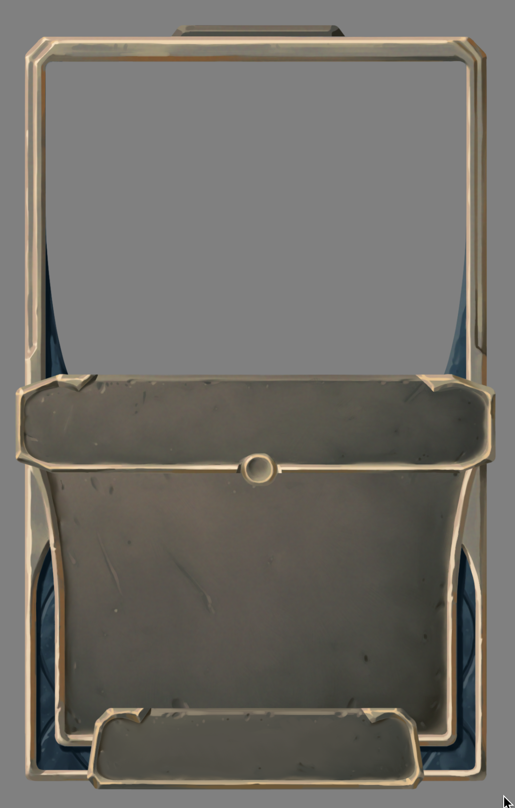

## Uploading Art

Coinciding with the launch on Steam, we're going to begin allowing Premium Season Pass owners to upload art directly to the Card Creator.

### Why?

One of our main concerns with Collective has always been player copyright infringement -- it's [Rule #1](/library/rules-new-cards#1-no-copyright-infringement), and always has been. We're a very small company and can't afford to deal with any kind of litigation. We'd also rather see players create new characters and worlds, rather than simply jump off of existing popular ones, even if copyright wasn't a thing. Collective doesn't get the same protections under the law as sites like Reddit or Facebook, where people frequently upload memes containing copyrighted content; we actually look at every card that goes into the game, so we don't have the plausible deniability that those companies do (this is explicitly part of the [DMCA](https://en.wikipedia.org/wiki/Digital_Millennium_Copyright_Act)).

Additionally, working with professional artists has given us new appreciation for how important their tools are in creating great art. The community has a ton of talented artists, and we can't wait to see what they create when they are able to use the tools of their choice.

By gating uploading behind the Season Pass, we're making sure only players that have a stake in Collective can use the feature. If a player uploads copyrighted content, they risk losing their Season Pass.

### Enforcement

We can't know every character or piece of art out there on the internet, and this was always a big concern for us. We're setting up a "Whistleblower" program for copyright infringing art uploads. **If a card gets into the game,** and you know the art or character is plagarized, send one of us a message and we'll investigate. If it turns out we have to remove the art (and limbo the card until it gets new art), you'll receive up to 500 Marbles from us. We won't reveal who reported the art to the rest of the community without your express permission. Again, the card has to be in the top 10 for a week for any of this to apply (or an Update that's been voted in).

Punishments for breaking the rules may include:

- A warning, for minor offenses
- Season Pass revocation
- Full account ban, for repeat offenders

### No Photos

We'd strongly prefer Collective's art to remain somewhat consistent and having photos in some cards' art would break that completely. Additionally, photos have legal complications since the people in a photo sometimes have legal rights over the photo. If uploaded art contains a photo it'll probably be removed (without the above punishments). Yes, we know the USGS tab in the card creator already has photos; these are landscapes generally meant to be used as backgrounds, and have looked reasonable so far. The purpose of this update is to allow for players to use software to make their own art and upload it, so photos in general are not the intended use of uploading art.

### Conclusion

One thing we liked about the restrictions of the current art tool, is how it gave the cards a somewhat consistent art style. We're hoping that can still continue going forward. We also wanted to reiterate how incredibly impressed we've been by the art created by the community using the existing art tool. There are many beautiful and well-composed pieces in the game, and we can't wait to see what you guys make with the restrictions removed!

## Integrated Community Art Sheet

We're working on a couple improvements to the Card Creator that make discovering community-made art easier to access. The "Community Art Sheet" will be directly accessible from the art editor in some form, and a random piece of art will be loaded in when you first open the page (as opposed to the blank art that's there currently). There's already a surplus of great art made by the community on there, and we think no one should feel they can't make cards just because they're not an artist.

## Cards Added Monthly

We're changing things so that cards are added to the multiplayer pool once a month instead of immediately upon getting into the game.

### Specifics

For people who remember this, it's a similar system to how Ranked cards were added before.

We are keeping the weekly process of 10 cards being added and tested on stream Friday. These cards will be available in singleplayer modes immediately, allowing for the potential of additional testing before being added into multiplayer.

The latest week of cards will never be added to the game immediately. Instead, once we have five weeks of cards added to singleplayer, the first four of them will be added to multiplayer.

Updates will affect cards immediately upon being voted in to prevent players from being locked into a bad meta for an entire month.

### Extra Testing

First of all, this has the benefit of allowing for a period of more in-depth testing of new cards in singleplayer modes. This is an elegant solution to a problem which was never going to go away; past an alpha, it is unacceptable for bugged cards to be regularly found in a competitive multiplayer environment. We'll never be able to catch every bug, but we think this will help a lot.

### Time for a Meta to Develop

Every other card game releases a set of cards once every three months, approximately. The meta is crazy for a couple weeks and then settles into something stable. Already, this looks unfamiliar to Collective. A stable meta with a handful of named decks? That's never been the case for more than a couple weeks at most.

We think a major missing aspect of Collective right now is the basic fun of playing around with a solid set of cards expected to stay essentially the same for any period of time. It's far too tempting to make the mental hop to, "what can I submit to Reddit to further improve the current meta?"

- My deck is decent, but not amazing? OK, time to go try to print some cards that will make it fully fleshed out.
- It's bad? Well, the whole reason I tried this out was because I thought it would be really cool/fun/interesting if it was good. What would it need to be good? Hmmm, maybe if I printed (something), then it would be awesome like I was thinking.
- It's really good? Uh oh, maybe this is too good. Not sure how the meta would eventually develop around this, but to be safe, I should go tell people and nerf the good cards before things get out of hand. Or maybe I should print a good counter to this.

When you have an idea for a deck in another card game, you try it out, and it will be bad, decent, or strong. If it's bad, people usually don't play it; if it's decent, sometimes people play because they enjoy it, or think it could get better with some more theorycrafting; if it's good, you'll keep playing it, and it can trigger a response in the meta. This doesn't happen in Collective, which leads to more issues than the immediately obvious problem of a meta too volatile for casual players to come back to.

Currently, player and creator behavior is disconnected from a healthy competitive spirit. Victories can feel hollow, decks don't have enough time to become famous (or infamous), and weak or unfinished archetypes get more attention than existing, well-built archetypes -- the opposite of how things normally are. The most obvious example of this we can think of is the couple times when a busted combo was discovered and people in Discord simply made a "gentleman's agreement" not to play with it. This is a very friendly behavior and really shows how nice the community is, but also a very bad sign of the game's health as a game instead of a testing ground for permanently unfinished gameplay.

To be clear, we are aware that some players enjoy the rapidly changing metagame. The change we're implementing will still involve a meta which shifts three times as fast as most other card games, and overpowered decks which have managed to get past the weeks of evaluation in singleplayer can still be nerfed within a week, so we think this is a good compromise.

### Why Four Weeks?

This is an experiment, and if it goes well, we'll continue doing it. Because we plan to sync this up with Seasons (which are generally three months, with a new hero being released halfway through) the ideal time would actually be six weeks, but we figured we'd try with four weeks for now. (Whenever cards are added in this system, the leaderboards will also be reset.) Adding cards once every three months feels too slow to us.

The biggest drawback to this system is the added complexity of clarifying what status a card has, which leads to the final part of this post.

## New Card Frames

Cards have different statuses, and we think it's important to distinguish these visually. These can include:

1. "Potential" cards (Reddit post, Card Creator card, card from In Game Voting)
1. "Fresh" cards: added to the game, but not available in Standard format
1. "Standard" cards, available in the Multiplayer Pool in the Standard format
1. "Rotated" cards, which rotated out
1. Possible others ("token" cards, Hero rewards)

We've been working on a new card frame which will help clarify these distinctions. It's looking great, thanks Harley!

This frame is designed to look polished and distinct, but not flashy. (Flashy frames are coming in cosmetics.) We're still working on it a bit, but here's our current idea:

- "Standard" cards will use the new frame.
- "Fresh" cards use the new frame, but the navy detail will be a more saturated orange instead, indicating that the card is new and "fresh."
- "Rotated" cards will have a "drained" color to the detail, probably a similar shade to the tan frame around it.
- "Potential" cards will use the existing (old) card frame, and from now on will signify a "prototype" of a card. When posted on Reddit, created in the Card Creator, and drafted via In Game Voting, cards will use the old frame. Cards that appear in [the Collection](/collection) will use the appropriate frame.
- We haven't decided whether to pursue frames for cards in category 5 yet.

This along with some UI improvements should help new players better understand the status of a card, as well as long time players who can't remember whether a card has rotated or not (which we're certainly guilty of).

## When Will The Chaos End?

Between these changes, the play/pass update, rotation, and probably other things we forgot, the game has gone through some massive changes recently. But from what we can tell, each one has been very positive, and we think this one will too. We don't foresee too many big changes like this happening after Steam release. Thanks for bearing with us through this.
