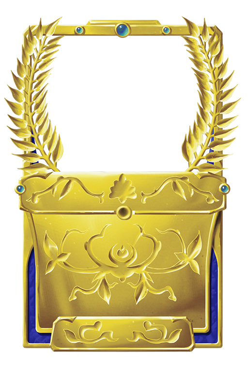

As previously announced, we’ll soon be allowing Premium Season Pass owners to upload art in the Card Creator. After thinking some more and talking to a lawyer, we’ll be making some changes to be fully compliant with the DMCA.

### Important Stuff:

* No more weekly card review stream.
* New cards and updates will be added automatically each week. This will happen about about the same time on Fridays as it currently does.
* Card creators will always receive 1000 Gold (split evenly among collaborators).
* As previously announced, cards will always be available in singleplayer for at least a week before entering multiplayer. This will give time to find bugs in the new cards. Keep an eye on cards with the orange “Fresh” border.
* Nick and I will continue handling card bug fixes manually through Discord. We may make this process more automated in the future.

### Copyright Enforcement

* When we receive a valid DMCA complaint, we will immediately Limbo the affected card.
* Under the DMCA, the card creator/art uploader will have a chance to respond to the complaint and prove they have the right to the content.
* Repeat infringers may receive a subreddit ban and/or Collective account ban.
* Our full DMCA policy and agent information is on our homepage.
* We won’t be awarding Marbles for copyright whistleblowing.

### Changes to Legal Status of Player Creations

Some players have expressed concerns about our ownership of characters or card designs they create, so we're changing our Terms to address those concerns. Similar to how player created art already worked, you own the content, and grant us a license to it by submitting it to the Card Creator. The new terms also clarify ownership of uploaded art.

    Old Text: Card designs and original characters you create in the Card Creator belong to us (Odious Studios). Same goes for art you create using any of the Card Creator's built-in images. Art you create entirely yourself in the card portrait creation tool belongs to you. You grant us a permanent license to use, reproduce, profit from, and re-license the art you create here.

    New Text: Art you (the player) create yourself in the card portrait creation tool, or art you upload belongs to you. Card designs and original characters you create in the Card Creator also belong to you. You grant us (Odious Studios) a permanent license to use, reproduce, profit from, and re-license any content (art, card designs, characters, etc.) you create or upload here. You agree to not license any of this content to other digital games without our agreement while Collective continues to operate.

### Other Changes

We’ve revamped the golden frame card creators get for the cards they get into the game. Check it out!

When it comes to anything structural related to voting and the systems around it, expect the developers to be much less likely to discuss details with players going forward. We will still read feedback, especially if it’s in a reddit post or in the #feature-request-concise or #bug-reports-concise channels on our Discord, but a policy of not talking about specifics is in our best interests for this topic, and is basically how other, similar things work.

