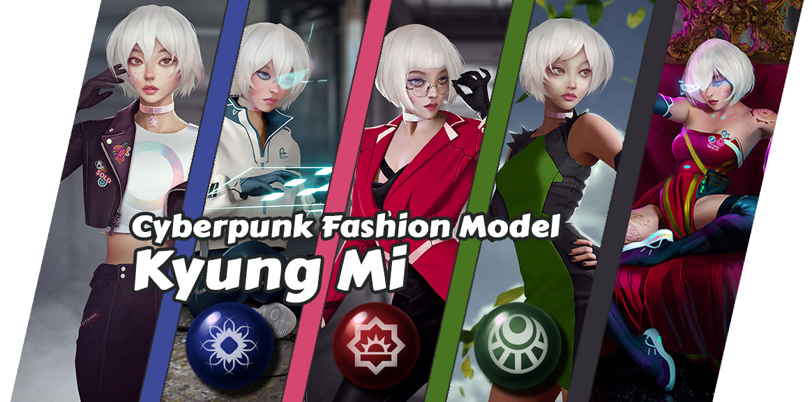
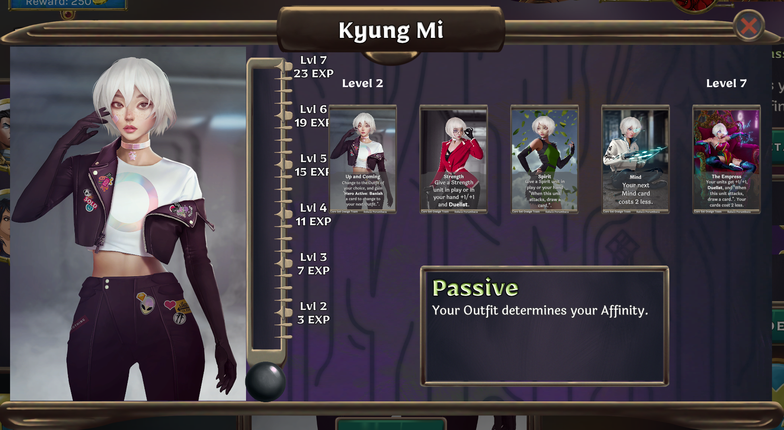

_Fashion icon Kyung Mi was perhaps the most famous citizen of Ethea, but behind the scenes she tirelessly fought to undermine the realm's tyrannical AI regime. Wanderstar, a complete technological backwater, has tested her ability to survive. A combination of wits, adaptability, and top-of-the-line cybernetics have allowed her to flourish as always, and she remains committed to her personal war against synthetic intelligences of any kind._

We're very excited to reveal our newest hero!

## Overview

Kyung Mi is drastically different from previous Heroes in many ways. At level 1, she has Neutral Affinity. When she reaches level 2, she becomes the Affinity of your choice. From then on, you can use her Hero Active to change to the next Affinity, at the cost of Banishing a card from your hand.

The order of Affinities is Strength -> Spirit -> Mind -> Strength. Keep in mind you choose to start anywhere in the chain at Level 2.

Each time Kyung Mi changes affinity, she gets a bonus:

* Strength: Give a Strength unit in play or in your hand +1/+1 and Duelist.
* Spirit: Give a Spirit unit in play or your hand "When this unit attacks, draw a card."
* Mind: Your next Mind card costs 2 less.

Kyung Mi only Drafts when she reaches levels 3 through 6, but only needs 4 EXP to advance through each of those levels.

At Level 7, Kyung Mi's ultimate - The Empress - activates, giving all of your cards the benefits of all of her Affinity swap bonuses.

Kyung Mi cannot play Affinity-Exclusive cards.

## Deck Building

Kyung Mi offers a lot of interesting deck building possibilities. Exchanging cards in her hand for unit buffs lends her to fast-paced tempo strategies. You could also create more of a control deck for her by playing EXP generating cards for card advantage, and using her powerful Ult to finish games. Simply being able to play low cost cards in an Affinity within the first few turns of the game gives her a lot of versatility and power. We can't wait to see what cards you play with her, and what cards are designed for her!

