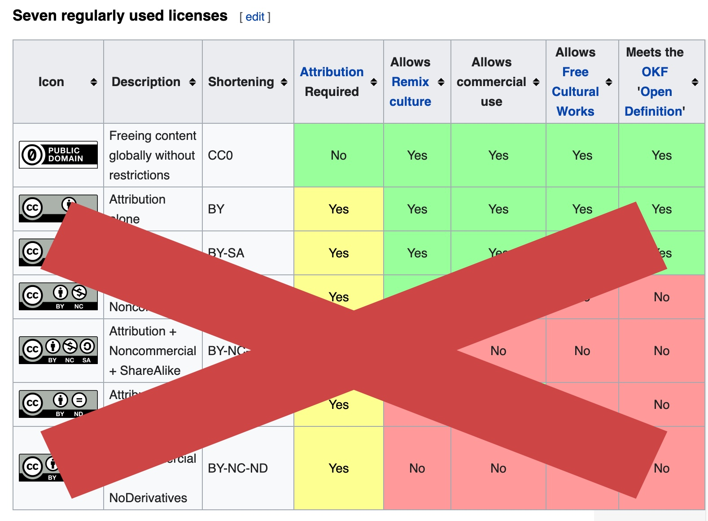
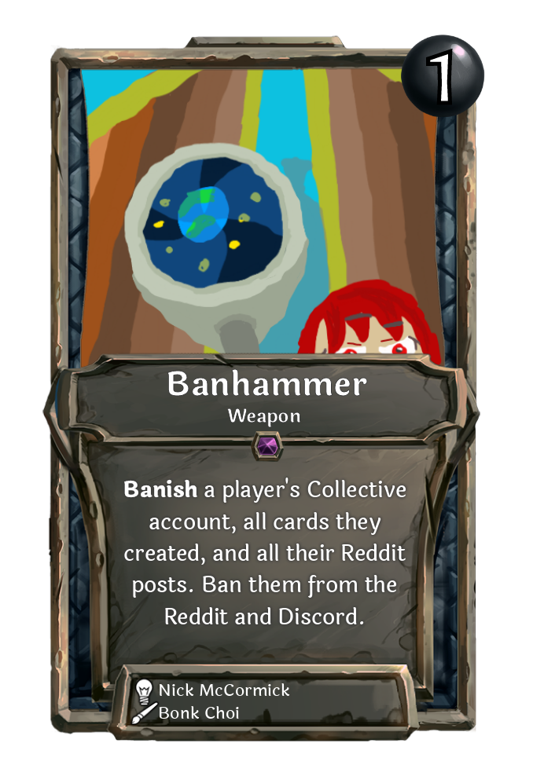

It's time that we had an article about copyright-free images and some of the traps users can fall into.

This page is meant to function as a resource as well, and we will try to keep it up to date. If you know of another page to add here, especially to the first section, please message Nick on [Discord](https://discord.gg/C8fTNVt).

## Very safe: Approved sites with original content

If you want to upload images from a site without any worries about infringing on copyright, there are some sites which actually do the legwork to confirm that submitted media is copyright-free. Many of these are nonprofits or government agencies. Here is an incomplete list, which we will update as we find more:

- [Wikimedia commons, category: CC-Zero](https://commons.wikimedia.org/wiki/Category:CC-Zero) Contains over 4 million files!
- [USDA ARS](https://www.ars.usda.gov/oc/images/image-gallery/) (Lots of nice images from nature)

## Risky: User-submission based sites

"Copyright free image" sites are often made up of user submissions. This is designed to make it so people can take a picture with their camera or create an original digital piece of art, upload it, and legally agree that the picture can be used by anyone. The way they actually make money is by serving ads.

However, a lot of these sites are cutouts which get put up and taken down repeatedly. This is because random people on the internet often find a copyrighted image and upload it to the site without understanding copyright law, and as this happens more and more, the image moves from site to site. "Orphaned" images like this make up most of the images on the internet; for example, essentially all images ever used in memes fit into this category.

"Copyright free image" sites are more likely to attract genuinely original submissions than, say, [imgur.com](https://imgur.com), but you can never be too careful. Some of them are good, but some are run entirely to generate ad revenue until someone calls them out. Site creators have little incentive to actually investigate copyright of the images they provide, as they can simply take the site down and recreate it with a slightly different name as soon as they get a cease-and-desist. Legal scholars refer to people who run sites like this as "dipshits."

### Step 1: Make sure they are CC0

First of all, the images basically need to be CC0. Here's a quick chart of all the Creative Commons licenses:

That's right, not even attribution licenses should be used. Most licenses don't allow for commercial usage, which makes them unsuitable for Collective; however, some CC attribution licenses do. Unfortunately, this is still not good enough for us. We could theoretically create some new system to allow people to cite the original artwork, but as it is right now with lots of art sharing tools like the Art Sheet which brings random art into the Card Creator when you hit the "randomize art" button, it's far too easy for an artist attribution to be erased.

In our experience, websites which actually use the term "Creative Commons Zero" or "CC0" are more likely to actually care about copyright. [This site](https://www.pikrepo.com), for example, simply says that their images are "royalty free" without mentioning a license. Almost no other information is provided, save for a link to what appears to be a [clone site](https://www.pikist.com/) for when the first one goes down.

If you must use these sites, here are some which say they provide a CC0 license:

- [pixabay.com](pixabay.com)
- [pexels.com](pexels.com)
- [negativespace.com](negativespace.com)
- [unsplash.com](unsplash.com)
- [openclipart.org](openclipart.org)

### Step 2: Reverse image search

If you got an image from one of these sites, you **must** run the image through [Google Reverse Image Search](https://images.google.com/?gws_rd=ssl) **and** [TinEye Reverse Image Search](https://tineye.com/) to verify that they do not have copyright restrictions. These sites are used by professionals to identify whether images are free of copyright or not. With the publishing of this blog post, we will be less forgiving of copyright infringement.

## Asking for a ban: Sites you already know not to use

But I might as well point them out anyway:

- Reddit
- Instagram
- Artstation
- Deviantart

If you are actually the artist of images which are also found on any of these sites, we will ask for you to prove it.

If you are uploading art that you downloaded from one of these sites, either you came out of a portal from a pre-enlightenment culture before modern concepts of copyright law were created, or you just don't know or care about copyright law. We live in a litigious country and have to be very careful about this topic as a small studio without a full time lawyer. As a result we lean very heavily on the side of copyright security. If it looks like you made an honest mistake, we may let you off with a warning, but sometimes we really have to bring out the banhammer.

## Help get the word out: Asking small artists for permission

This is a new concept which we will be trying out, but I am actually optimistic about.

We are currently working on a much better beginning-of-game experience, and one of our most optimistic goals is to make a game which is fun and rewarding for people who have not played a lot of card games. It's still quite a while off, but part of the idea is to attract new perspectives and bring them into Collective.

One of the ways we think this could be a nice win-win would be to get small artists interested in Collective. If you see a small artist on Reddit, Instagram, Artstation, Deviantart, etc. with art you want to use, **try asking them if you can use their art.** This is how we got art from [Tom Kyzivat](https://www.artstation.com/murderousautomaton) and other talented artists.

**If they are interested, tell us, and we will contact them via the contact info listed on their site or social media.** (Screenshots can help convince us that they are interested, but we will still need to contact them ourselves.) We don't want to be annoying, so we recommend you contact artists who have fewer than 1000 followers. There are a ton of extremely talented artists with robust portfolios that, in our experience, love the idea of having their art in a card game.

A lot of artists like to stream their art on Twitch just for fun. Searching for low-viewer [Art streams on Twitch](https://www.twitch.tv/directory/game/Art) and developing relationships with artists there could make this feel more collaborative and less like you're asking them for something and giving nothing in return.

## Thanks

Thanks for reading. If you have any suggestions of sites to add or remove, please contact Nick on [Discord](https://discord.gg/C8fTNVt).
